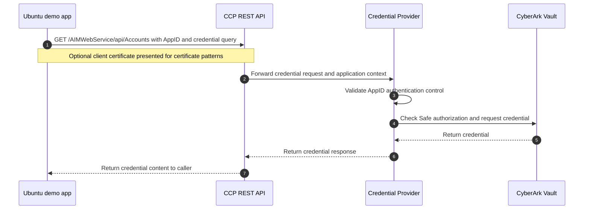

# Demo Validation

This guide validates the deployed CCP REST API demo. It assumes `./setup.sh` has completed and the generated client certificate is trusted by the CCP server for client certificate authentication.

## Start Here

Load the same configuration used by setup:

```bash
cd demos/credential_providers/rest_api_ubuntu
set -a
source ../../setup_env.sh
source setup/vars.env
set +a
```

Check the generated certificate identity:

```bash
openssl x509 -in app.crt -noout -serial -issuer -subject
openssl x509 -in app.crt -noout -text | sed -n '/Subject Alternative Name/,+1p'
```

The output should include the issuer values and SANs from `setup/vars.env`.

## About

The demo uses CyberArk CCP to broker credential retrieval through the REST API. The application calls CCP with an AppID and account query. CCP validates the AppID authentication controls, checks whether the AppID has Safe access, retrieves the credential from CyberArk, and returns the credential content to the caller.

The demo contains three AppID patterns:

- Allowed machine authentication.
- Certificate serial number authentication.
- Certificate attribute authentication with Issuer and SAN.

## Workflow



For the certificate attribute pattern, the important identity is not the certificate serial number. CyberArk evaluates the certificate Issuer and Subject Alternative Name values configured on the AppID.

## Core Validation

Confirm the demo values:

```bash
printf "Safe: %s\nAppIDs: %s %s %s\n" "$SAFE_NAME" "$CCP_APP1_ID" "$CCP_APP2_ID" "$CCP_APP3_ID"
cat cert_serial_number
```

Run the complete demo:

```bash
./demo.sh
```

The script runs one request for each AppID pattern. Successful requests return the retrieved credential response or credential content.

## Pattern 1: Allowed Machine

This pattern authorizes the AppID by the caller's public IP address. It proves that CCP can restrict REST API retrieval to an expected machine or network location.

```bash
curl -sk "$PAS_BASE_URL/AIMWebService/api/Accounts?AppID=$CCP_APP1_ID&Safe=$SAFE_NAME&UserName=ssh-user-1" | jq .
```

Success proves the request came from the allowed machine and the AppID has Safe read access.

## Pattern 2: Certificate Serial Number

This pattern authorizes the AppID by the generated certificate serial number. It proves client certificate authentication works, but the AppID is tied to one certificate instance.

```bash
curl -sk "$PAS_BASE_URL/AIMWebService/api/Accounts?AppID=$CCP_APP2_ID&Safe=$SAFE_NAME&UserName=ssh-user-1" \
  --cert app.crt \
  --key app.key | jq -r .Content
```

Success proves CCP received the client certificate, the serial number matched the AppID authentication rule, and the AppID had Safe access.

## Pattern 3: Certificate Issuer And SAN

This pattern authorizes the AppID with certificate attributes instead of a serial number. It is the better fit for short-lived certificates because renewal can keep the same issuer and SAN values while changing the serial number.

```bash
curl -sk "$PAS_BASE_URL/AIMWebService/api/Accounts?AppID=$CCP_APP3_ID&Safe=$SAFE_NAME&UserName=ssh-user-1" \
  --cert app.crt \
  --key app.key | jq -r .Content
```

Success proves CyberArk accepted the client certificate based on the configured Issuer and Subject Alternative Name values, then authorized the AppID against the Safe.

## Compare The Patterns

Allowed machine authentication is useful when the caller has a stable network identity. Certificate serial number authentication is simple but operationally brittle for certificate renewal. Certificate attribute authentication binds access to the workload certificate identity, so renewed certificates can continue working when issuer and SAN values remain stable.

## Troubleshooting

If a REST call fails, validate the failure point:

- `401` or TLS client certificate errors usually point to CCP/IIS certificate trust or client certificate settings.
- `403` usually points to AppID authentication, allowed machine restrictions, certificate attribute mismatch, or missing Safe access.
- Empty or unexpected credential results usually mean the Safe or `UserName` query does not match the stored credential.

Useful checks:

```bash
openssl x509 -in app.crt -noout -serial -issuer -subject
openssl x509 -in app.crt -noout -text | sed -n '/Subject Alternative Name/,+1p'
cat setup/vars.env
cat cert_serial_number
```
