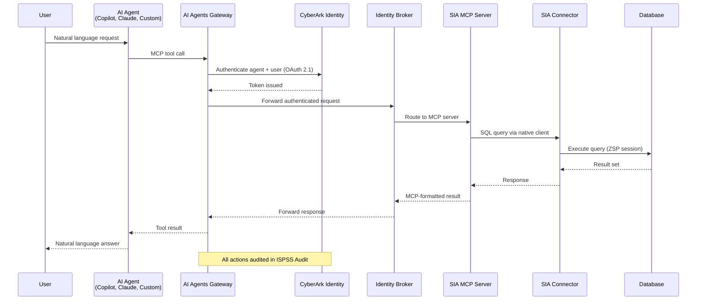

# CyberArk Secure AI Agents: Documentation Overview

## Table of Contents

1. [Introduction](#introduction)
2. [Core Architecture](#core-architecture)
   - [AI Agents Gateway](#ai-agents-gateway)
   - [Secure Infrastructure Access MCP Server](#secure-infrastructure-access-mcp-server)
   - [Agent Identity Broker](#agent-identity-broker)
3. [Key Workflows](#key-workflows)
   - [Agent Registration & Onboarding](#agent-registration--onboarding)
   - [Connecting MCP Servers to Agents](#connecting-mcp-servers-to-agents)
   - [Secure Access & Enforcement](#secure-access--enforcement)
   - [Audit & Governance](#audit--governance)
4. [Security Principles](#security-principles)
5. [Integration with Other CyberArk Services](#integration-with-other-cyberark-services)
6. [Key Terms](#key-terms)
7. [Automation in This Repo](#automation-in-this-repo)
8. [References](#references)

---

## Introduction

CyberArk Secure AI Agents extends the CyberArk Identity Security Platform to secure AI agent identities and their interactions with enterprise resources. It provides governance, least privilege access, and full auditability for AI agents accessing databases, SaaS platforms, and internal APIs.

The solution uses an **identity-first approach** that starts with visibility:

1. **Discover** AI agents across SaaS, cloud, and developer environments (AWS Bedrock, Microsoft Copilot Studio).
2. **Register** selected agents to establish an AI agent identity with OAuth 2.1 credentials.
3. **Enforce** least privilege by routing access through the AI Agents Gateway and Secure Infrastructure Access MCP server.
4. **Audit** every action — linking the initiating human user to the AI agent identity, tool activity, and target resources.

The solution leverages the **Model Context Protocol (MCP)** for secure, identity-based tool access, ensuring agents operate with **zero standing privileges (ZSP)** and are fully audited.

---

## Core Architecture

### AI Agents Gateway

**Role:** Identity and policy enforcer for all AI agent traffic.

| Capability | Detail |
|---|---|
| Authentication | Validates both the agent identity and the initiating human user via CyberArk Identity |
| Policy enforcement | Enforces least privilege and ZSP — access is granted per-task, then revoked |
| Request routing | Routes all agent requests through the SIA MCP server; agents never access resources directly |
| Credential isolation | No credentials are ever exposed to the AI model or its context window |
| Audit | Logs every MCP session, tool discovery, and tool execution to ISPSS Audit |

The Gateway URL is unique per registered agent and serves as the agent's MCP server address.

### Secure Infrastructure Access MCP Server

**Role:** Secure conduit for agent-to-resource communication.

| Capability | Detail |
|---|---|
| Protocol translation | Converts natural language requests into MCP-formatted operations |
| Query execution | Uses native database clients to execute authorized SQL queries |
| Credential management | Uses short-lived tokens; credentials never reach the agent |
| Tool exposure | Exposes `run_query` and `list_databases` tools to connected agents |
| Connector Management | Connects through SIA Connector to databases in self-hosted environments |

The MCP server relies on SIA connectors deployed in the customer's environment to reach target databases. Without SIA configured, an agent connects to the Gateway but sees **0 tools available**.

### Agent Identity Broker

**Role:** Authentication and authorization bridge between agents and MCP servers.

| Capability | Detail |
|---|---|
| Request forwarding | Forwards authenticated requests from the Gateway to the target MCP server |
| URL routing | Each MCP server is exposed through a unique Identity Broker URL |
| OAuth 2.1 orchestration | Generates and manages OAuth 2.1 credentials (Client ID, Client Secret, Gateway URL) |
| Authorization enforcement | Authenticates and authorizes every request before forwarding |

When an MCP server uses `None` as the authentication type (no built-in auth), CyberArk acts as the authorization service and provides credentials in the connection details.

---

## Key Workflows

### Agent Registration & Onboarding

The onboarding sequence must be completed in this order:

**Step 1 — Deploy & configure SIA:**

- Install SIA connectors in your environment to reach target databases
- Create ZSP access policies for each database resource
- The SIA MCP server exposes `run_query` and `list_databases` tools

**Step 2 — Register the AI agent:**

| Field | Description |
|---|---|
| Agent name | Unique within tenant (2–256 characters) |
| Agent type | Predefined (`Claude`, `Copilot`) or `Custom` |
| Redirect URL | HTTPS OAuth callback URL(s), up to 10 |
| Description | Plain text, up to 500 characters |
| Owners | Users/roles from CyberArk Identity (informational, up to 10) |
| Tags | Key-value pairs for filtering (up to 10, 1–30 chars each) |

**Step 3 — Connect the agent:**

CyberArk generates OAuth 2.1 credentials **shown only once**:

| Credential | Purpose |
|---|---|
| Gateway URL | Unique gateway address for this agent |
| Client ID | Auto-generated identifier |
| Client Secret | Auto-generated secret for authentication |

Additional parameters for agents that don't fully support OAuth 2.1:

| Parameter | Purpose |
|---|---|
| Authorization URL | OIDC sign-in endpoint |
| Token URL | Exchange grant for access/refresh tokens |
| Refresh URL | Obtain new access token without re-prompting |

### Connecting MCP Servers to Agents

After registering and enabling an MCP server, connect it to agents:

**Microsoft Copilot:**
1. Open Microsoft 365 Admin Center > Tools > Connectors > MCP integrations
2. Paste the MCP server Gateway URL
3. Provide Client ID and Client Secret from authorization service
4. Complete authentication flow and save

**Claude Desktop:**
1. Settings > Tools or Integrations > Add MCP server
2. Paste the MCP server Gateway URL
3. Select the AI agent to retrieve credentials
4. Verify tools are discovered

**Custom AI Agent:**
1. Ensure agent supports MCP-compatible remote tool endpoints
2. Configure the Gateway URL as the remote tool endpoint
3. Configure OAuth 2.1 authorization flow with Client ID and Client Secret
4. Run a test tool call to confirm connectivity

### Secure Access & Enforcement

The runtime flow enforces that every user prompt is routed through the AI Agents Gateway:

1. **User authenticates** via CyberArk Identity through the Gateway
2. **Agent requests** are routed through the Gateway to the MCP server
3. **MCP server enforces** policy and executes authorized commands via native database clients
4. **Results return** securely to the agent — no credentials exposed

### Audit & Governance

All events are recorded in CyberArk Audit with timestamps, descriptions, identifiers, source/target details, and unique audit codes.

**Agent lifecycle management:**

| Event | What is captured |
|---|---|
| Agent created | Who registered, agent details, source IP |
| Agent edited | Who modified, what changed |
| Agent suspended / reactivated | State transition, who triggered it |
| Agent deleted | Who removed, agent ID |

**MCP activity:**

| Event | What is captured |
|---|---|
| Initialization | User starts MCP session with agent |
| Tools/List | Agent requests available tools from Gateway |
| Tools/Call | Agent executes a tool — includes tool name and arguments (excluding sensitive data) |
| Errors | Failed MCP actions (protocol, auth, tool invocation failures) |

**Agent lifecycle states:**

| State | Meaning |
|---|---|
| Pending connection | Registered but not yet connected to Gateway |
| Active | Fully configured and operational |
| Suspended | Temporarily disabled — cannot communicate through this gateway URL |
| Error | System issue (e.g., invalid credentials) prevents operation |

---

## Security Principles

| Principle | How SAI enforces it |
|---|---|
| **Zero Standing Privileges** | Agents receive permissions for specific tasks only; access is revoked automatically after use |
| **Least Privilege** | Seven enforcement layers: Cloud IAM, tool access, MCP connections, model access, data access, network access, delegation scope |
| **Credential Isolation** | Secrets never enter the AI model's context window — the Gateway and MCP server handle credentials |
| **Identity-Based Access** | Every agent has a unique OAuth 2.1 identity; every action is tied to both agent and initiating human |
| **Full Attribution** | Five-layer audit trail: identity/session, tool/API calls, data access, business context, delegation chain |

These principles directly address OWASP Top 10 for LLMs:
- **LLM01 (Prompt Injection)** — credentials never in the context window
- **LLM06 (Sensitive Information Disclosure)** — vault-first architecture
- **LLM08 (Excessive Agency)** — 7-layer least privilege enforcement
- **LLM09 (Overreliance)** — full audit trail for every agent action

---

## Integration with Other CyberArk Services

### Secrets Manager

Provides the foundational security layer for AI agents: credentials, API keys, tokens, and NHI secrets are securely stored, dynamically accessed, and never hardcoded. Enforces least-privilege access, automated secret rotation, JIT credential retrieval, and full audit across the agent lifecycle. Eliminates credential sprawl and prevents secret leakage through prompts, code, or logs.

See [Secrets Manager docs](https://docs.cyberark.com/secrets-manager-saas/latest/en/content/resources/_topnav/cc_home.htm).

### Secure Web Sessions (SWS)

Prevents AI-powered browsers from accessing sensitive systems by enforcing policy-governed browser environments. Enables session recording and real-time session control for high-risk activities within AI Builder platforms — creating agents or modifying instructions. Provides strong authentication, full audit, and Zero Trust enforcement over privileged interactions.

See [Secure Web Sessions docs](https://docs.cyberark.com/sws/latest/en/content/resources/_topnav/cc_home.htm).

### Discovery & Context

Discovers AI agents across environments (AWS Bedrock, Microsoft Copilot Studio) to understand which agents exist, who owns them, and their status. Agents discovered here can be registered and secured in the AI Agents Gateway.

### Secure Infrastructure Access (SIA)

Provides the actual database connectivity layer. SIA connectors reach target assets in self-hosted environments through the zero standing privilege framework. SIA MCP server exposes `run_query` and `list_databases` tools to agents via the Gateway.

---

## Key Terms

| Term | Definition |
|---|---|
| **AI agent** | An application or service (Claude, Copilot, custom app) that uses AI to perform tasks and may require access to tools or data sources |
| **AI Agents Gateway** | The control point — agents connect through it to access MCP servers, enforcing identity and policy |
| **MCP server** | Service endpoint using Model Context Protocol to expose tools (initially SIA for database access) |
| **Tools** | Predefined interfaces allowing an AI model to interact with external systems (e.g., `run_query`, `list_databases`) |
| **Register** | Configuring an agent with the Gateway to generate OAuth 2.1 credentials |
| **Identity Broker** | Intermediary that authenticates requests and routes them to the correct MCP server |

---

## Automation in This Repo

The portfolio workflow automates SAI setup via `setup/sai/setup.sh`:

| Action | Trigger |
|---|---|
| Agent registration | `SAI_AGENT_NAME` set in `setup/vars.env` |
| Agent activation | Automatic after registration |
| SIA MCP server registration | `SAI_AIGW_SIA_MCP_URL` set in `setup/vars.env` |

For manual API setup and tenant prerequisites (roles, MCP inventory access, known issues), see [`dp_tenant_preparations.md`](dp_tenant_preparations.md).

For the full variable reference, see Stage 7 in [`demo_setup.md`](../../demo_setup.md).

For validation steps, see Step 8 in [`demo_validation.md`](../../demo_validation.md).

For the presenter narrative, see Step 8 in [`talk_track.md`](../../talk_track.md).

---

## References

| Resource | URL |
|---|---|
| Introduction | <https://docs.cyberark.com/early-release/secure-ai-agents/content/secureai/introduction.htm> |
| Architecture | <https://docs.cyberark.com/early-release/secure-ai-agents/content/secureai/architecture.htm> |
| Register & Connect Agents | <https://docs.cyberark.com/early-release/secure-ai-agents/content/secureai/registeragent.htm> |
| Connect MCP Servers | <https://docs.cyberark.com/early-release/secure-ai-agents/content/secureai/connect%20mcp%20servers%20to%20agents.htm> |
| Cross-Product Integration | <https://docs.cyberark.com/early-release/secure-ai-agents/content/secureai/crossproduct.htm> |
| SIA Connector Install | <https://docs.cyberark.com/ispss-deployment/latest/en/content/setup/dpa_install-connector.htm> |
| Database ZSP Policies | <https://docs.cyberark.com/ispss-access/latest/en/content/db/dpa-database-manage-zsp.htm> |
| Secrets Manager | <https://docs.cyberark.com/secrets-manager-saas/latest/en/content/resources/_topnav/cc_home.htm> |
| Secure Web Sessions | <https://docs.cyberark.com/sws/latest/en/content/resources/_topnav/cc_home.htm> |
