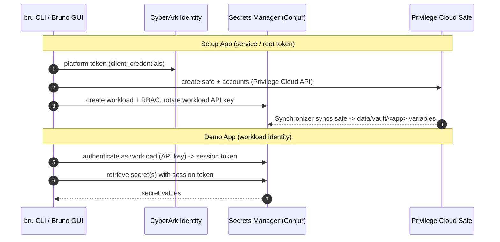

# Demo: Bruno API (ALM API Key Auth)

This demo showcases the CyberArk Secrets Manager **API** using the
[`poc-sm-saas-bruno`](https://github.com/David-Lang/poc-sm-saas-bruno) Bruno collection.
It sets up an application (safe, accounts, workload/machine identity, RBAC) and then
demonstrates a workload authenticating with its API key and retrieving secrets — runnable
both from the **Bruno CLI** (`bru`) and the **Bruno GUI**.

Use the repo-standard docs for deployment and validation:

- `demo_setup.md`
- `demo_validation.md`

References:

- [Bruno](https://usebruno.com)
- [Secrets Manager authentication methods](https://docs.cyberark.com/secrets-manager-saas/latest/en/content/operations/authn/authn-lp.htm)

## About

- The collection's **Setup App** section uses the service account (the "Idira root
  service token") to configure ISP roles, a Privilege Cloud safe with sample accounts,
  a Secrets Manager **workload** (machine identity), RBAC grants, and rotates the
  workload API key.
- The **Demo App** section authenticates *as the workload* using that API key and
  retrieves secrets — no human/service credentials at runtime.
- Inputs map from the shared framework creds: `TENANT_ID -> IspTenantId`,
  `TENANT_SUBDOMAIN -> IspSubDomain`, `CLIENT_ID -> IspServiceClientId`,
  `CLIENT_SECRET -> IspServiceClientSecret`, plus `UseCaseAlmAppName`.

## Workflow



## Key Files

- `setup.sh`
  Installs the Bruno CLI, clones the collection, generates a git-ignored Bruno env from
  the service creds, runs the Setup App section, and captures the workload API key.
- `demo.sh`
  Runs the Demo App section (workload authenticate + retrieve secrets) via `bru run`,
  narrating each request and response.
- `remove.sh`
  Tears down the app created by setup (Conjur workload policy, Privilege Cloud safe +
  accounts, and the ISP `<app>-admins` role).
- `info.yaml`
  Demo metadata.

The collection is cloned into `.collection/` (git-ignored); the generated Bruno
environment `.collection/collection/environments/cybr.secret.bru` holds the service creds
and captured workload key and is never committed.

## Run it

CLI:

```bash
cd "$CYBR_DEMOS_PATH/demos/secrets_manager/bruno_api"
./setup.sh      # configure the app + capture the workload key
./demo.sh       # authenticate as the workload and retrieve secrets
./remove.sh     # (optional) tear the app back down
```

GUI: see `demo_validation.md` — open the cloned collection in Bruno, select the `cybr.secret`
environment, and click through the Setup App then Demo App sections.
