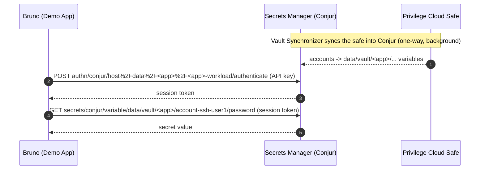

# Bruno API Demo Validation

Validates that an application workload can authenticate to Secrets Manager with its API
key and retrieve secrets, using the `poc-sm-saas-bruno` collection — via both the Bruno
CLI and the Bruno GUI.

## Start Here

Identify the objects created by setup (default `UseCaseAlmAppName=poc-alm-app`):

- Workload (machine identity): `data/<app>/<app>-workload`
- Safe / accounts: `data/vault/<app>/account-ssh-user1`, `account-ssh-user2`
- Bruno environment: `.collection/collection/environments/cybr.secret.bru` (holds the
  service creds + captured `almAppName_workload_ApiKey`)

## About

- **CyberArk Identity** issues the service-account platform token used during setup.
- **Secrets Manager (Conjur)** authenticates the workload via its API key and authorizes
  reads against the synced safe.
- **Bruno** drives the API calls; the same collection runs in the CLI and the GUI.

## Workflow



## Core Validation (CLI)

```bash
cd "$CYBR_DEMOS_PATH/demos/secrets_manager/bruno_api"
./demo.sh
```

`demo.sh` narrates the flow: it prints the app/identity context, the planned API
calls, runs the Demo App section with `bru run`, then shows each request and its
response. Expect all four requests to pass, in order:
`Authenticate`, `Retrieve Secret`, `Retrieve Secrets (Batch) v2`, `List Secrets`.
The Conjur session token is masked in the output; the sample account secret values
are shown (they are fake lab data).

## Pattern 1: CLI (`bru run`)

- What it does: runs the Demo App section headless with the `cybr.secret` environment.
- What to validate: `Authenticate` returns a session token (masked in the output);
  the retrieve calls return the sample account secret values and `List Secrets` shows
  only this app's variables.
- CyberArk behavior: the workload authenticates with its API key (not a human/service
  credential) and is authorized only for its app's safe (least privilege).

## Pattern 2: Bruno GUI

- Open Bruno and open the cloned collection at
  `.collection/collection` (`bruno.json`).
- Enable Bruno developer settings (allows dynamic variable/session capture).
- Select the `cybr.secret` environment.
- Click through **1 Setup App** top-to-bottom (first time), then **2 Demo App**
  top-to-bottom.
- What to validate: each request returns 200; the environment's `almAppName_workload_ApiKey`
  and `useCaseAlmAppName.sessionToken` populate as you run the steps.

## Compare The Patterns

- **CLI** is repeatable/automatable (CI, scripted demos).
- **GUI** is best for interactive, step-by-step walkthroughs that show each request and
  response and how variables chain.

## Troubleshooting

- `Authenticate` 401: the workload API key is stale/missing — re-run `./setup.sh` to
  re-capture it into the env.
- Retrieve returns 403: confirm the workload's RBAC grant to the safe was created.
- GUI variables not populating: enable Bruno developer settings and confirm the `cybr.secret`
  environment is selected.
- The `poc-cdn-isp` environment in the collection is an example and may contain stale or
  placeholder values — use the generated `cybr.secret` environment for this demo.
