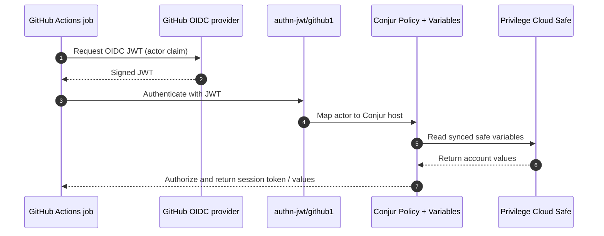

# Demo: GitHub Actions

This demo shows GitHub Actions workflows retrieving secrets from CyberArk Secrets Manager by authenticating with a GitHub OIDC JWT (and, optionally, a workload API key) instead of long-lived static credentials. The secrets are synchronized into Secrets Manager from a Privilege Cloud safe.

Use the repo-standard docs for deployment and validation:

- `demo_setup.md`
- `demo_validation.md`

Official CyberArk references for this use case:

- [Secrets Manager authentication methods](https://docs.cyberark.com/secrets-manager-saas/latest/en/content/operations/authn/authn-lp.htm)
- [Set up JWT authentication](https://docs.cyberark.com/secrets-manager-saas/latest/en/content/operations/authn/authenticate-jwt-config.htm)

GitHub references for OIDC:

- [About security hardening with OpenID Connect](https://docs.github.com/en/actions/deployment/security-hardening-your-deployments/about-security-hardening-with-openid-connect)
- [OIDC configuration endpoint](https://token.actions.githubusercontent.com/.well-known/openid-configuration)

## About

- GitHub Actions requests a short-lived OIDC JWT that carries the workflow `actor` claim.
- The `authn-jwt/github1` authenticator validates that JWT against the GitHub JWKS and issuer.
- Secrets Manager maps the `actor` claim to a Conjur host under `data/workloads/github-actor`.
- Conjur authorizes that host to read variables synchronized from the demo safe.
- The workflows in the `idira-github-actions` repo consume the result via the `cyberark/conjur-action` plugin, raw `curl`, or the Conjur Terraform provider.

## Workflow

## Key Files

- `setup.sh`
  Provisions the safe, the JWT authenticator, and the workload, then renders the GitHub handoff values.
- `setup/vars.env`
  Shared demo configuration: `SAFE_NAME` and `JWT_CLAIM_IDENTITY` (env-overridable).
- `setup/vault/setup.sh`
  Creates the demo safe, grants required members, and creates `account-ssh-user-1`.
- `setup/conjur/setup.sh`
  Creates and activates the `github1` JWT authenticator and the `github-actor` workload, and grants safe access.
- `setup/github/setup.sh`
  Renders `settings_variables.env` with the `CONJUR_*` values GitHub needs.
- `remove.sh`
  Removes the workload and safe artifacts created by setup.

## GitHub Handoff

This demo provisions the Secrets Manager server side. The GitHub repository variables, secrets, and environments are populated by the `idira-github-actions` repo, whose `scripts/bootstrap-poc.sh` runs this setup, maps `CONJUR_* -> SM_*`, provisions the api-key credential, and calls `scripts/init-gh-vars-secrets.sh`.
