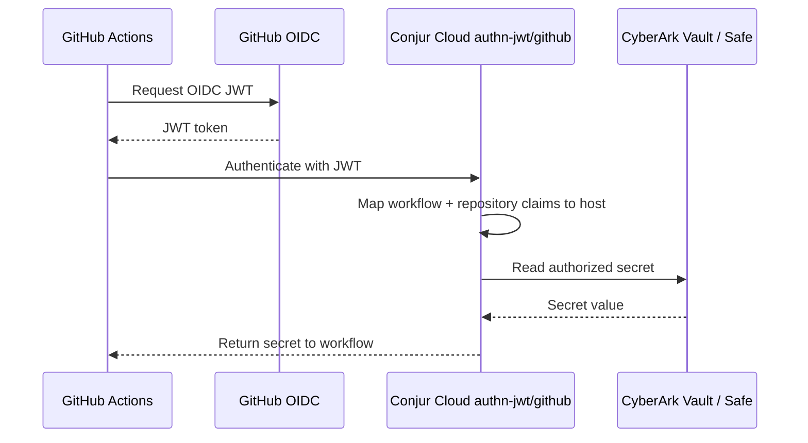

# Demo: GitHub Actions OIDC

### About

- This demo shows GitHub Actions using OIDC JWT authentication to retrieve secrets from CyberArk Secrets Manager through Conjur Cloud.
- The GitHub workflow does not need a static Conjur API key.
- Access follows [CyberArk Secrets Manager SaaS / GitHub Actions](https://docs.cyberark.com/secrets-manager-saas/latest/en/content/integrations/github-actions.htm): JWT authenticator id `github`, `token-app-property: workflow`, `identity-path: data/github-apps`, `enforced-claims: workflow,repository`, and a host annotated with `authn-jwt/github/repository` and `authn-jwt/github/workflow`.

### Configuration

1. Update `setup/vars.env`:
   - `SAFE_NAME`
   - `GITHUB_REPOSITORY` (must match the `repository` OIDC claim, e.g. `owner/repo`)
   - `GITHUB_WORKFLOW` (must match the `workflow` OIDC claim — typically the workflow `name:` in the YAML file, not only the filename)
2. Ensure `demos/tenant_vars.sh` is configured:
   - `TENANT_ID`
   - `TENANT_SUBDOMAIN`
   - `CLIENT_ID`
   - `CLIENT_SECRET`
3. Ensure you have a GitHub repository with Actions enabled and `gh` CLI authenticated.

### Workflow



### Command-Line Walkthrough

Use the setup and interactive demo scripts:

```shell
cd demos/secrets_manager/github.com
bash setup.sh
bash demo.sh
```

`demo.sh` walks through:
- Conjur JWT policy setup
- workload identity mapping (`data/github-apps`)
- GitHub variable values
- workflow selection (`jwt-plugin`, `jwt-direct`, `apikey-plugin`)
- optional live `gh` workflow dispatch and run watch

### Example GitHub Variables (set via CLI)

```shell
gh variable set CONJUR_ACCOUNT --repo "owner/repo" --body "conjur"
gh variable set CONJUR_JWT_AUTHN_ID --repo "owner/repo" --body "github"
gh variable set CONJUR_SECRET_ID_1 --repo "owner/repo" --body "data/vault/<safe>/account-ssh-user-1/username"
gh variable set CONJUR_SECRET_ID_2 --repo "owner/repo" --body "data/vault/<safe>/account-ssh-user-1/password"
gh variable set CONJUR_URL --repo "owner/repo" --body "https://<tenant-subdomain>.secretsmgr.cyberark.cloud/api"
```

```json
{
  "SECRET_1": "account-ssh-user-1",
  "SECRET_2": "superSecret1"
}
```

https://token.actions.githubusercontent.com/.well-known/openid-configuration

https://github.blog/changelog/2021-10-27-github-actions-secure-cloud-deployments-with-openid-connect/

https://docs.github.com/en/actions/deployment/security-hardening-your-deployments/configuring-openid-connect-in-cloud-providers
