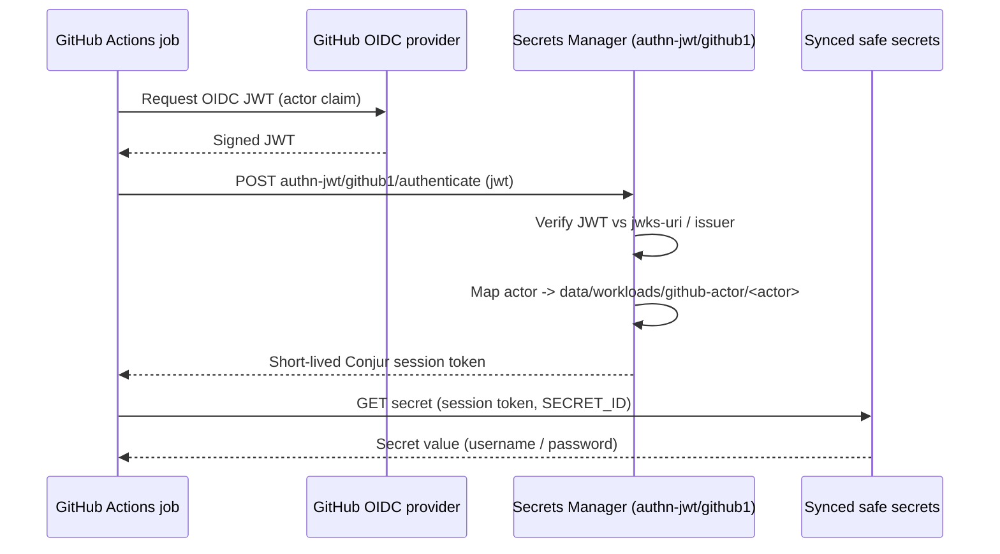

# GitHub Actions Demo Validation

This demo lets GitHub Actions workflows authenticate to CyberArk Secrets Manager (Idira) and read secrets synchronized from a Privilege Cloud safe. The server side is provisioned by `demo_setup.md`; the workflows live in the `idira-github-actions` repository.

## Start Here

Identify the target objects created by setup:

- Tenant: `https://<TENANT_SUBDOMAIN>.secretsmgr.cyberark.cloud`
- JWT authenticator: `conjur/authn-jwt/github1` (must be active)
- Workload host: `data/workloads/github-actor/<JWT_CLAIM_IDENTITY>`
- Safe: `<SAFE_NAME>` (default `poc-github`) with `account-ssh-user-1`
- Secrets consumed: `data/vault/<SAFE_NAME>/account-ssh-user-1/username` and `.../password`

## About

CyberArk components involved:

- **JWT authenticator (`github1`)** — validates the GitHub OIDC token against the GitHub JWKS/issuer and maps the `actor` claim to a Conjur host under `data/workloads/github-actor`.
- **Workload identity** — the host `data/workloads/github-actor/<actor>`, which is a consumer of the authenticator and of the safe delegation group. It is annotated `authn/api-key: true`, so it can also authenticate with a rotated API key.
- **Safe delegation** — synchronization from Privilege Cloud creates `vault/<safe>/delegation/consumers`; the workload is granted into it to read the synced account secrets.

## Workflow



For the api-key pattern, the first two OIDC steps are replaced by the workload host authenticating with `host_id` + rotated `api_key`.

## Core Validation

Confirm the server side is healthy before running any workflow. Obtain a Conjur token (see the demo helpers `get_identity_token` / `get_conjur_token`), then:

- Authenticator status is healthy:

```bash
curl -s -H "Authorization: Token token=\"$CONJUR_TOKEN\"" \
  "https://$TENANT_SUBDOMAIN.secretsmgr.cyberark.cloud/api/authn-jwt/github1/conjur/status"
```

- The workload host exists:

```bash
curl -s -H "Authorization: Token token=\"$CONJUR_TOKEN\"" \
  "https://$TENANT_SUBDOMAIN.secretsmgr.cyberark.cloud/api/resources/conjur?kind=host" \
  | jq -r '.[].id' | grep 'workloads/github-actor'
```

- The safe delegation consumers group is present (synchronization completed):

```bash
curl -s -H "Authorization: Token token=\"$CONJUR_TOKEN\"" \
  "https://$TENANT_SUBDOMAIN.secretsmgr.cyberark.cloud/api/resources/conjur?kind=group" \
  | jq -r '.[].id' | grep "$SAFE_NAME/delegation/consumers"
```

## Pattern 1: GitHub OIDC JWT (plugin and direct)

- What it does: the workflow requests a GitHub OIDC JWT and exchanges it for a Conjur session token, then reads the secret.
- Identity/access controls: the `actor` claim must match the workload host id; the host must be a consumer of `authn-jwt/github1` and of the safe delegation group.
- Validate with the `idira-github-actions` workflows:
  - `sm-plugin-jwt.yml` and `sm-plugin-jwt-env-aware.yml` (via `cyberark/conjur-action`)
  - `sm-direct-jwt.yml` (raw `curl`)
  - `sm-plugin-jwt-terraform.yml` (the Conjur Terraform provider authenticates with `authn_type = "jwt"`)

```bash
gh workflow run sm-plugin-jwt.yml --ref aardvark --repo David-Lang/idira-github-actions
gh run watch --repo David-Lang/idira-github-actions
```

- What the result proves: no static credential is stored in GitHub; access is granted only to the matching `actor` identity.
- CyberArk behavior: Secrets Manager verifies the JWT signature/issuer, enforces the `token-app-property`/`identity-path` mapping, and authorizes the read against the synced safe.

## Pattern 2: Host ID + API Key

- What it does: the workflow authenticates with a host id and API key instead of OIDC.
- Identity/access controls: the same workload host is used; its API key is provisioned by rotating it (`rotate_workload_api_key`), and stored as the GitHub secrets `SM_USERNAME`/`SM_API_KEY`.
- Validate with `sm-plugin-apikey.yml`:

```bash
gh workflow run sm-plugin-apikey.yml --ref aardvark --repo David-Lang/idira-github-actions
```

- What the result proves: the same identity and authorization model works for non-OIDC callers.
- CyberArk behavior: Secrets Manager authenticates the host with its API key, then authorizes the same synced-safe read.

## Compare The Patterns

- Prefer **Pattern 1 (JWT/OIDC)** for GitHub-hosted workflows: short-lived, no stored secret.
- Use **Pattern 2 (API key)** for callers that cannot present a GitHub OIDC token, accepting the stored-secret tradeoff and rotation responsibility.

## Troubleshooting

- `401`/authentication errors on JWT: confirm `authn-jwt/github1` is active and `jwks-uri`/`issuer` match GitHub; confirm the `actor` claim matches the workload host id.
- `403`/authorization errors on read: confirm the workload host is granted into `vault/<safe>/delegation/consumers` and the secret path is correct.
- Empty or missing secret: confirm `account-ssh-user-1` exists in the safe and synchronization has completed.
- API-key pattern failures: re-provision the key (rotate) and confirm `SM_USERNAME` is the full `host/data/workloads/github-actor/<actor>` id.
- GitHub side missing variables/secrets: re-run the demo `setup.sh` (its `setup/github` stage is idempotent and re-seeds the repo via `gh`).
