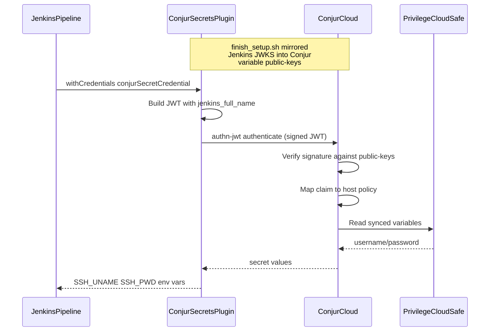
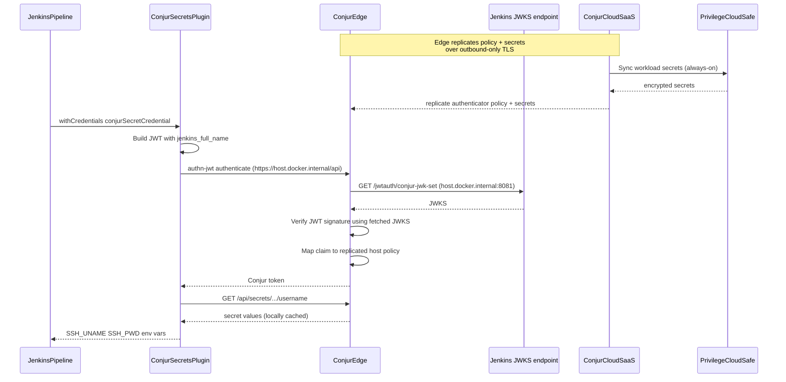

# Demo Validation

Assume `bash go.sh` completed and `bash ready_check.sh` passes.

## Start Here

```bash
cd demos/secrets_manager/jenkins
source setup/vars.env
source setup/.jenkins.env
```

| URL | Use |
|-----|-----|
| `http://127.0.0.1:8081` | Presenter browser (local) |
| `$JENKINS_PUBLIC_URL` | Public Jenkins root URL — informational; **not** required for auth in default public-keys mode |
| `$JENKINS_JWKS_URI` | Public JWKS — only used if you opt out of public-keys mode (Conjur fetches signing keys over the internet) |
| `http://127.0.0.1:8081/job/global-credentials-demo/` | Pipeline job |

## About

| Component | Role |
|-----------|------|
| Privilege Cloud safe | Stores `account-ssh-user-1` credentials |
| Conjur sync | Exposes secrets under `data/vault/<SAFE_NAME>/...` |
| `authn-jwt/<CONJUR_JWT_AUTHN_ID>` | Validates Jenkins JWT; maps `jenkins_full_name` to host (default id: `jenkins1`) |
| Host `data/jenkins-apps/<JWT_CLAIM_IDENTITY>` | Workload identity (default `GlobalCredentials`) |
| Conjur Secrets plugin | Mints JWT, authenticates, injects pipeline credentials |

Note on JWT signature trust: by default the demo runs in **public-keys mode** — `finish_setup.sh` mirrors the live Jenkins JWKS into the Conjur `public-keys` variable and deletes `jwks-uri`. Conjur verifies JWT signatures locally against `public-keys` (no outbound network call). This makes the demo work on a laptop without a public tunnel. The plugin rotates its in-memory key periodically and on every Jenkins restart; `finish_setup.sh` is the idempotent fix-up.

The demo also supports a second architecture: **Edge mode** (`CONJUR_AUTH_TARGET=edge` + `JWT_TRUST_MODE=jwks-uri`). In Edge mode, a `cybr-conjur-edge` container runs alongside Jenkins on the Docker host. Conjur policy stores `jwks-uri = http://host.docker.internal:8081/...`, the Jenkins plugin's appliance URL flips to `https://host.docker.internal/api`, and Edge replicates policy + secrets from Conjur Cloud over an outbound-only TLS connection. See `setup/edge/README.md` for bring-up.

Official reference: [Jenkins integration](https://docs.cyberark.com/secrets-manager-saas/latest/en/content/integrations/jenkins.htm).

## Workflow

### Default (cloud + public-keys)



### Edge variant (CONJUR_AUTH_TARGET=edge + JWT_TRUST_MODE=jwks-uri)



## Core Validation (after go.sh)

`go.sh` automates plugin configuration and creates job **global-credentials-demo**. Verify:

### 1. Conjur plugin (JWT)

**Manage Jenkins** → **System** → **CyberArk Secrets Manager Conjur Configuration**

| Field | Expected (cloud target) | Expected (edge target) |
|-------|-------------------------|------------------------|
| Authentication | JWT | JWT |
| Conjur account | `conjur` | `conjur` |
| Appliance URL | `https://<TENANT_SUBDOMAIN>.secretsmgr.cyberark.cloud/api` | `https://host.docker.internal/api` |
| Service ID | `authn-jwt/<CONJUR_JWT_AUTHN_ID>` (default `authn-jwt/jenkins1`) | same |
| Identity from token | `jenkins_full_name` | `jenkins_full_name` |

**JWT Token Claims** → `jenkins_full_name: GlobalCredentials` (matches `JWT_CLAIM_IDENTITY`).

Quick CLI verification of the live Conjur side (run from the demo dir):

```bash
source setup/vars.env
source "$CYBR_DEMOS_PATH/demos/setup_env.sh"
T=$(get_identity_token "$TENANT_ID" "$CLIENT_ID" "$CLIENT_SECRET")
C=$(get_conjur_token "$TENANT_SUBDOMAIN" "$T")
curl -sS "https://${TENANT_SUBDOMAIN}.secretsmgr.cyberark.cloud/api/authn-jwt/${CONJUR_JWT_AUTHN_ID}/conjur/status" \
  -H "Authorization: Token token=\"${C}\"" | jq
```

Expected: HTTP 200 and `{"status":"ok"}`. A 500 with `CONJ00037E Missing value for resource: ...audience` means the authenticator variables are not fully populated — run `bash finish_setup.sh`.

### 2. TLS

Handled by `import_sm_cert.sh`. If HTTPS errors persist, re-run:

```bash
bash import_sm_cert.sh
```

### 3. Pipeline build

1. Open `http://127.0.0.1:8081/job/global-credentials-demo/`
2. **Configure** → **Refresh Credential Store** (if shown)
3. **Credentials** — Conjur IDs for `data/vault/<SAFE_NAME>/account-ssh-user-1/...`
4. **Build Now**
5. **Console Output** — masked `SSH_UNAME` / `SSH_PWD`
6. Workspace **demo.txt** — spaced characters (not cleartext in log)

### 4. Live rotation (optional)

1. Note password in Privilege Cloud (`account-ssh-user-1` in `SAFE_NAME` safe)
2. Change password in Privilege Cloud
3. Wait for Conjur Sync (~15s)
4. **Build Now** again — new values injected

Or run step 10 in `bash demo.sh` (polls Conjur, then re-run build).

## Manual path (without go.sh automation)

If Jenkins was set up by hand:

1. Wizard + install **Conjur Secrets** plugin
2. `bash import_sm_cert.sh`
3. Configure JWT per table above (values from `setup/.jenkins.env`)
4. New **Pipeline** job → paste `setup/jenkins/pipeline/get_secrets.groovy`

## What Success Proves

- JWT authentication — no Conjur API key in the job
- Policy grants access to synced safe paths only
- `conjurSecretCredential` injects secrets at pipeline runtime
- Console masking works

## Troubleshooting

The single most useful command when anything looks broken:

```bash
bash finish_setup.sh
```

It is idempotent and re-syncs every piece of the JWT auth chain. If `finish_setup.sh` itself succeeds and ends with `End-to-end verified`, the demo is healthy.

| Symptom | Likely cause | Fix |
|---------|--------------|-----|
| Build fails with `Authentication failed. Cannot get token from Conjur for context: ...` | Stale JWKS in Conjur (plugin rotated its key — happens on Jenkins restart and on a 60-minute timer) | `bash finish_setup.sh` |
| `withCredentials` reports empty `$SSH_UNAME` / `$SSH_PWD` | `credentialsId` not in the slash-separated Conjur path format (plugin v3.x requires the full path) | `bash render_pipeline.sh && bash finish_setup.sh` |
| Conjur `/status` returns 500 `CONJ00037E ...audience` | The SaaS UI marks audience optional but Conjur requires it | `bash finish_setup.sh` sets it to `cyberark-conjur` |
| Conjur returns 401 with empty body and everything seems fine | JWT `iss` claim does not exactly match Conjur's `issuer` variable (often a trailing-slash mismatch) | `bash finish_setup.sh` sets `issuer = $JENKINS_LOCAL_URL` (no slash) |
| No credentials in Jenkins store | `ConjurSecretCredentialsImpl` entries not created | `bash finish_setup.sh` creates them via script console |
| JWKS fetch error from Conjur | `jwks-uri` variable is set to an unreachable URL | `bash finish_setup.sh` deletes `jwks-uri` and uses `public-keys` mode (no outbound Conjur→Jenkins network required) |
| TLS errors talking to Conjur Cloud | Java truststore missing SM root | `bash import_sm_cert.sh` |
| Wrong secret path | `SAFE_NAME` mismatch between `vars.env` and pipeline IDs | `bash render_pipeline.sh && bash finish_setup.sh` |

For full debugging, decode a live JWT issued by the plugin and verify each claim against the corresponding Conjur variable. Quick recipe:

```bash
# Mint a JWT via the plugin's class
CRUMB=$(curl -sS -u admin:admin -c /tmp/j -b /tmp/j http://127.0.0.1:8081/crumbIssuer/api/json | jq -r .crumb)
curl -sS -u admin:admin -c /tmp/j -b /tmp/j -X POST -H "Jenkins-Crumb: $CRUMB" \
  --data-urlencode 'script=
import jenkins.model.Jenkins
def cl = Jenkins.instance.pluginManager.getPlugin("conjur-credentials").classLoader
def jwtCls = cl.loadClass("org.conjur.jenkins.jwtauth.impl.JwtToken")
def cfgCls = cl.loadClass("org.conjur.jenkins.configuration.GlobalConjurConfiguration")
def cfg = cfgCls.getMethod("get").invoke(null)
def jwt = jwtCls.getMethod("getToken", Object.class, cfgCls).invoke(null, Jenkins.instance, cfg)
def b = jwt.split("\\.")[1].replace("-","+").replace("_","/")
while (b.length() % 4 != 0) b += "="
println(new String(java.util.Base64.decoder.decode(b)))
' http://127.0.0.1:8081/scriptText
```

You should see `iss`, `aud`, `sub`, `jenkins_full_name`, `exp`, `iat`, `kid`. Each must match Conjur:

- `iss` ↔ Conjur `conjur/authn-jwt/<id>/issuer` variable (exact string)
- `aud` ↔ Conjur `conjur/authn-jwt/<id>/audience` variable
- `sub` ↔ Conjur host id under `data/jenkins-apps/<sub>`
- `kid` ↔ `kid` of the first key in Conjur `conjur/authn-jwt/<id>/public-keys`

Re-run CyberArk binding only: `bash finish_setup.sh`  
Re-run Jenkins plugin config + job (restarts Jenkins): `bash configure_jenkins.sh && bash finish_setup.sh`

Presenter walkthrough: `bash demo.sh` (11 steps, mode-aware — tells the Edge story when `CONJUR_AUTH_TARGET=edge`). Talk track: `talktrack.md`.
