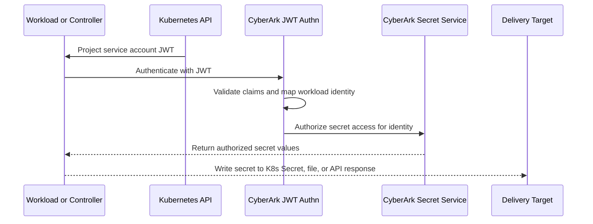

# Kubernetes Demo Validation

This walkthrough starts after `./setup.sh` has completed and the Helm release is already installed.

The deployment path in this repo is Rancher-first, but the runtime patterns validated here are standard Kubernetes patterns. The goal is to inspect the live workloads, confirm that CyberArk authentication and authorization are working, and understand how each secret delivery model behaves.

## Start Here

Move into the demo directory and load the shared demo variables:

```bash
cd demos/secrets_manager/k8s
source setup/vars.env
export DEMO_NAMESPACE="$SM_SERVICE_NAME"
```

Confirm that the namespace and main workloads exist:

```bash
kubectl get all -n "$DEMO_NAMESPACE"
kubectl get secret,configmap,serviceaccount -n "$DEMO_NAMESPACE"
kubectl get secretstore,externalsecret -n "$DEMO_NAMESPACE"
```

You should see these main demo workloads:

- `demo-k8-secrets`
- `demo-k8-secrets-fetch-all`
- `demo-push-to-file`
- `demo-push-to-file-fetch-all`
- `alpine-curl`

You should also see these shared resources:

- `sm-configmap`
- `demo-scripts`
- `poc-service-account`
- `db-credential`
- `demo-k8-secret-fetch-all`
- `SecretStore/conjur`
- `ExternalSecret/conjur`

## About The CyberArk Components

This demo uses CyberArk Secrets Manager JWT authentication for Kubernetes workloads.

The common components are:

- `sm-configmap`
  - provides the CyberArk service URLs, authenticator ID, account, and certificate
- `poc-service-account`
  - provides the Kubernetes workload identity used by every demo workload
- projected service account JWT
  - mounted at `/var/run/secrets/tokens/jwt`
- `cyberark/secrets-provider-for-k8s`
  - used as either an init container or sidecar depending on the pattern
- External Secrets Operator
  - retrieves secrets through a `SecretStore` and syncs them into a Kubernetes `Secret`

Validate the shared configuration first:

```bash
kubectl get configmap sm-configmap -n "$DEMO_NAMESPACE" -o yaml
kubectl get serviceaccount poc-service-account -n "$DEMO_NAMESPACE" -o yaml
kubectl get role,rolebinding -n "$DEMO_NAMESPACE"
```

These values in `sm-configmap` are the core CyberArk connection settings:

- `CONJUR_ACCOUNT`
- `CONJUR_APPLIANCE_URL`
- `CONJUR_AUTHN_URL`
- `AUTHENTICATOR_ID`
- `CONJUR_SSL_CERTIFICATE`

What this proves:

- workloads know which CyberArk tenant and JWT authenticator to use
- the service account identity is present in the namespace
- RBAC exists for the patterns that write back to Kubernetes secrets

## Request And Retrieval Flow

Every pattern in this demo starts with the same identity flow:

1. Kubernetes projects a service account token into the pod.
2. The workload or controller presents that JWT to CyberArk.
3. CyberArk validates the JWT and maps the token claims to the configured workload identity.
4. CyberArk evaluates the policy attached to that identity.
5. Authorized secret values are returned and then delivered as a Kubernetes secret, a mounted file, or direct API output.



Inspect the projected JWT from the helper pod:

```bash
kubectl exec -n "$DEMO_NAMESPACE" deploy/alpine-curl -- \
  cat /var/run/secrets/tokens/jwt > /tmp/k8s-demo.jwt

jq -R 'split(".") | {header: .[0] | @base64d | fromjson, payload: .[1] | @base64d | fromjson}' \
  /tmp/k8s-demo.jwt
```

Focus on these claims:

- `sub`
- `aud`
- namespace and service account fields in the payload

What this proves:

- the pod received a projected JWT
- the token audience is set for CyberArk
- the Kubernetes identity in the JWT is the identity CyberArk will evaluate

## Quick Validation Of Core Resources

Before validating each pattern, confirm that the shared runtime pieces are healthy:

```bash
kubectl get pods -n "$DEMO_NAMESPACE" -o wide
kubectl get events -n "$DEMO_NAMESPACE" --sort-by=.lastTimestamp | tail -20
kubectl get pods -n external-secrets
```

What to validate:

- all demo pods are `Running`
- init-container-based workloads reached ready state
- the External Secrets Operator controller is healthy
- there are no recent auth, mount, or secret sync errors in namespace events

## Pattern 1: K8s Secrets

This pattern uses the provider as an init container and writes values into a native Kubernetes `Secret`.

The seed secret is `db-credential`. It starts with a `conjur-map` that maps Kubernetes secret keys to CyberArk secret IDs. The application then consumes `username` and `password` through `secretKeyRef`.

Validate the workload and generated secret:

```bash
kubectl get secret db-credential -n "$DEMO_NAMESPACE" -o yaml
kubectl describe pod -n "$DEMO_NAMESPACE" -l app=demo-k8-secrets
kubectl logs -n "$DEMO_NAMESPACE" -l app=demo-k8-secrets -c cyberark-secrets-provider-for-k8s --previous
```

Decode the populated secret values:

```bash
kubectl get secret db-credential -n "$DEMO_NAMESPACE" -o jsonpath='{.data.username}' | base64 -d; echo
kubectl get secret db-credential -n "$DEMO_NAMESPACE" -o jsonpath='{.data.password}' | base64 -d; echo
kubectl get secret db-credential -n "$DEMO_NAMESPACE" -o jsonpath='{.data.conjur-map}' | base64 -d; echo
```

What to validate:

- the pod is running
- the init container completed successfully
- `db-credential` contains the requested keys
- the app container can start after the provider populates the Kubernetes secret

What CyberArk is doing:

- authenticating the pod with the projected JWT
- authorizing the workload against the mapped identity
- retrieving only the listed secret IDs
- returning values to the provider so it can update the Kubernetes secret

What this proves:

- CyberArk can broker secrets into a standard Kubernetes `Secret`
- the application can consume secrets without calling CyberArk directly

## Pattern 2: K8s Secrets FetchAll

This pattern still writes into a Kubernetes `Secret`, but the seed secret contains:

```text
"*": "*"
```

That tells the provider to fetch the full set of variables authorized for the workload identity and write them into `demo-k8-secret-fetch-all`. The application imports the resulting values with `envFrom`.

Validate the secret and pod behavior:

```bash
kubectl get secret demo-k8-secret-fetch-all -n "$DEMO_NAMESPACE" -o yaml
kubectl describe pod -n "$DEMO_NAMESPACE" -l app=demo-k8-secrets-fetch-all
kubectl logs -n "$DEMO_NAMESPACE" -l app=demo-k8-secrets-fetch-all -c cyberark-secrets-provider-for-k8s --previous
```

Check which keys were written:

```bash
kubectl get secret demo-k8-secret-fetch-all -n "$DEMO_NAMESPACE" -o json | jq -r '.data | keys[]'
```

What to validate:

- the pod is running
- the secret exists and contains more than the original `conjur-map`
- the init container completed and populated the secret successfully
- the workload could import all returned keys as environment variables

What CyberArk is doing:

- authenticating once with the workload JWT
- evaluating the full permission set for that identity
- returning every secret currently authorized for the workload

What this proves:

- the workload can do broad secret sync when policy allows it
- authorization scope matters more in this pattern because over-permissioning has a larger blast radius

## Pattern 3: Push To File

This pattern runs the provider as a sidecar and writes a YAML file into a shared in-memory volume mounted at `/opt/secrets/conjur`.

The application does not read a Kubernetes `Secret`. It reads the file written locally by the sidecar.

Validate the pod and file delivery:

```bash
kubectl get pod -n "$DEMO_NAMESPACE" -l app=demo-push-to-file
kubectl describe pod -n "$DEMO_NAMESPACE" -l app=demo-push-to-file
kubectl exec -n "$DEMO_NAMESPACE" deploy/demo-push-to-file -c app-container -- \
  cat /opt/secrets/conjur/credentials.yaml
kubectl logs -n "$DEMO_NAMESPACE" deploy/demo-push-to-file -c cyberark-secrets-provider-for-k8s
```

What to validate:

- both containers are running
- the shared volume is mounted into both containers
- `credentials.yaml` exists and contains the expected keys
- the sidecar refresh loop is running without errors

What CyberArk is doing:

- authenticating the sidecar with the pod JWT
- retrieving only the explicitly requested variables
- rendering them into a YAML file in the shared volume
- refreshing that file on the configured interval

What this proves:

- CyberArk can deliver secrets as files instead of Kubernetes secret objects
- the application can consume locally mounted material without secret values being embedded in the pod spec

## Pattern 4: Push To File FetchAll

This is the file-based equivalent of FetchAll. The workload uses:

```text
conjur.org/conjur-secrets.test-app: "*"
```

That asks the sidecar to retrieve all variables authorized for the workload and write them into the generated file.

Validate the file output:

```bash
kubectl get pod -n "$DEMO_NAMESPACE" -l app=demo-push-to-file-fetch-all
kubectl describe pod -n "$DEMO_NAMESPACE" -l app=demo-push-to-file-fetch-all
kubectl exec -n "$DEMO_NAMESPACE" deploy/demo-push-to-file-fetch-all -c app-container -- \
  cat /opt/secrets/conjur/credentials.yaml
kubectl logs -n "$DEMO_NAMESPACE" deploy/demo-push-to-file-fetch-all -c cyberark-secrets-provider-for-k8s
```

What to validate:

- both containers are running
- the file exists in the shared volume
- the file contains the full authorized set, not only two named variables
- periodic refresh is still working

What CyberArk is doing:

- authenticating with the same pod identity model
- returning the workload’s full authorized secret set
- letting the sidecar regenerate the output file on refresh

What this proves:

- FetchAll works in the file delivery model too
- broad retrieval remains a policy-sensitive pattern and should be scoped carefully

## Pattern 5: External Secrets Operator

This pattern moves retrieval into the controller model.

The chart creates:

- `SecretStore/conjur`
- `ExternalSecret/conjur`

ESO requests a service account token for `poc-service-account`, authenticates to CyberArk through the JWT authenticator, retrieves the remote variables listed in `remoteRef.key`, and syncs them into a Kubernetes `Secret` named `conjur`.

Validate the ESO resources and synced secret:

```bash
kubectl get secretstore,externalsecret -n "$DEMO_NAMESPACE"
kubectl get secretstore conjur -n "$DEMO_NAMESPACE" -o yaml
kubectl get externalsecret conjur -n "$DEMO_NAMESPACE" -o yaml
kubectl get secret conjur -n "$DEMO_NAMESPACE" -o yaml
kubectl logs -n external-secrets deploy/external-secrets
```

What to validate:

- the `SecretStore` is ready
- the `ExternalSecret` reports a successful sync
- the generated `Secret` exists and contains the requested keys
- the ESO controller logs do not show JWT or provider errors

What CyberArk is doing:

- accepting a controller-driven JWT authentication flow
- evaluating the same workload identity and policy boundary
- returning the specific remote references requested by the `ExternalSecret`

What this proves:

- the controller can broker CyberArk secrets into Kubernetes-native secrets on a refresh schedule
- retrieval is decoupled from the application pod lifecycle

## Pattern 6: Direct JWT Authentication And Retrieval

The `alpine-curl` helper deployment is the cleanest way to validate the raw API flow without the provider or ESO abstractions.

The pod mounts the same projected JWT and loads the same CyberArk connection settings from `sm-configmap`. It also mounts `demo-scripts`, which contains `direct.sh`.

Run the direct retrieval flow:

```bash
kubectl exec -n "$DEMO_NAMESPACE" deploy/alpine-curl -- /opt/demo/direct.sh
```

If you want to inspect the steps manually, validate the token and auth endpoint first:

```bash
kubectl exec -n "$DEMO_NAMESPACE" deploy/alpine-curl -- sh -c 'echo "$CONJUR_AUTHN_URL"'
kubectl exec -n "$DEMO_NAMESPACE" deploy/alpine-curl -- sh -c 'ls -l /var/run/secrets/tokens && wc -c /var/run/secrets/tokens/jwt'
```

What to validate:

- the helper pod is running
- the JWT file exists in the pod
- CyberArk returns a session token for the JWT authentication request
- the secret retrieval API returns the expected secret value

What CyberArk is doing:

- validating the JWT directly at the authn-jwt endpoint
- minting a session token for the mapped identity
- authorizing a direct secret read through the variable API

What this proves:

- the base authn and retrieval path works even without the Kubernetes provider
- failures in higher-level patterns can be isolated to provider or controller behavior versus core JWT authn

## Pattern Comparison

The main tradeoffs in this demo are:

- K8s Secrets
  - provider writes a native Kubernetes `Secret`
  - best when apps already expect `secretKeyRef` or `envFrom`
- Push To File
  - provider writes a mounted file
  - best when apps expect local file material or refreshable file content
- External Secrets Operator
  - controller syncs CyberArk values into Kubernetes `Secret` objects
  - best when you want cluster-managed sync behavior outside pod startup
- FetchAll variants
  - reduce per-key configuration
  - increase risk if the workload identity is granted too many secrets
- Direct `curl`
  - lowest-level diagnostic path
  - best for proving the JWT authn path independently of provider integrations

## Troubleshooting

If a pattern fails, isolate the problem in this order.

Check workload health:

```bash
kubectl get pods -n "$DEMO_NAMESPACE"
kubectl describe pod -n "$DEMO_NAMESPACE" <pod-name>
kubectl get events -n "$DEMO_NAMESPACE" --sort-by=.lastTimestamp | tail -30
```

Check the projected JWT and service account:

```bash
kubectl get serviceaccount poc-service-account -n "$DEMO_NAMESPACE" -o yaml
kubectl exec -n "$DEMO_NAMESPACE" deploy/alpine-curl -- sh -c 'ls -l /var/run/secrets/tokens && head -c 40 /var/run/secrets/tokens/jwt; echo'
```

Check CyberArk connection settings:

```bash
kubectl get configmap sm-configmap -n "$DEMO_NAMESPACE" -o yaml
```

Check provider logs:

```bash
kubectl logs -n "$DEMO_NAMESPACE" deploy/demo-push-to-file -c cyberark-secrets-provider-for-k8s
kubectl logs -n "$DEMO_NAMESPACE" deploy/demo-push-to-file-fetch-all -c cyberark-secrets-provider-for-k8s
kubectl logs -n "$DEMO_NAMESPACE" -l app=demo-k8-secrets -c cyberark-secrets-provider-for-k8s --previous
kubectl logs -n "$DEMO_NAMESPACE" -l app=demo-k8-secrets-fetch-all -c cyberark-secrets-provider-for-k8s --previous
```

Check ESO status:

```bash
kubectl get secretstore,externalsecret -n "$DEMO_NAMESPACE" -o yaml
kubectl logs -n external-secrets deploy/external-secrets
```

Common failure points:

- the service account JWT audience does not match the CyberArk JWT authenticator configuration
- the workload identity mapping in CyberArk does not match the JWT claims
- the workload has insufficient policy permission for the requested secrets
- `sm-configmap` has the wrong authenticator URL, tenant URL, or certificate
- RBAC is missing for the patterns that update Kubernetes `Secret` objects
- ESO is healthy, but the `SecretStore` or `ExternalSecret` reports provider auth errors

Use the direct `alpine-curl` flow whenever you need to separate core JWT authn problems from provider-specific behavior.
