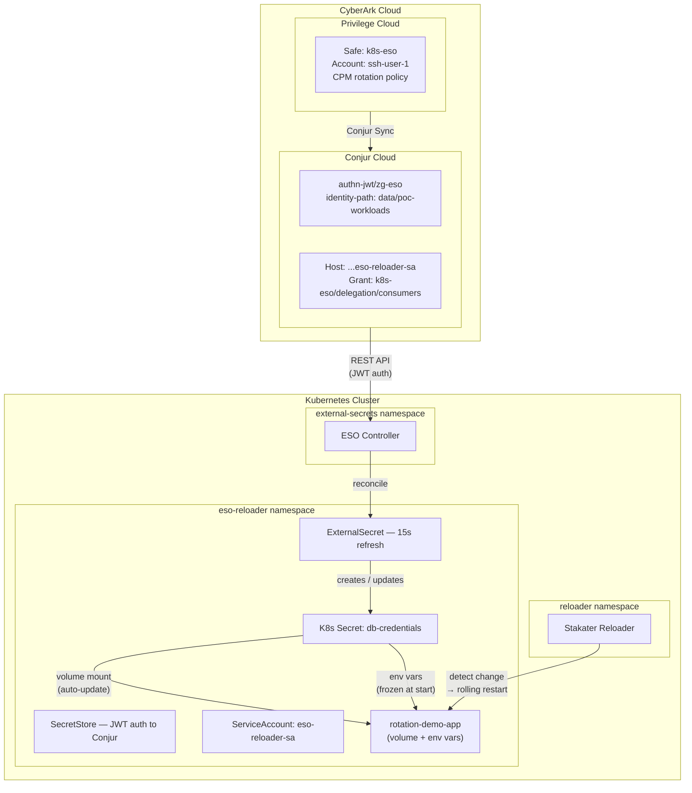
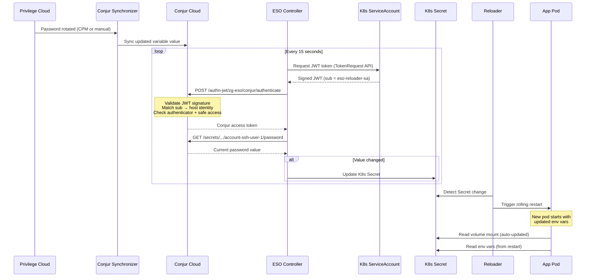

# Auto-Rotate Kubernetes Secrets — Demo Validation

ESO polls CyberArk Conjur Cloud every 15 seconds and updates a native K8s Secret when the upstream password changes. The sample application consumes the secret two ways: volume mount (auto-updates) and environment variables (Reloader triggers pod restart).

## Start Here

Confirm your kubectl context and the demo namespace:

```bash
kubectl config current-context
kubectl get ns eso-reloader
```

All demo resources live in the `eso-reloader` namespace. ESO controller pods run in `external-secrets`. Reloader runs in `reloader`.

## About

| Component | Role |
|---|---|
| **Privilege Cloud** | Source of truth — safes, accounts, passwords, CPM rotation policies |
| **Conjur Synchronizer** | Replicates Privilege Cloud safes and accounts into Conjur Cloud variables |
| **Conjur Cloud** | Secrets manager — JWT authentication, policy-based access control, API retrieval |
| **External Secrets Operator** | K8s controller — watches ExternalSecret CRs, authenticates to Conjur, writes K8s Secrets |
| **K8s ServiceAccount** | Workload identity — JWT token is the authentication credential |
| **Stakater Reloader** | Watches K8s Secrets for changes, triggers rolling restart on annotated Deployments |

## Architecture



## Workflow



## Core Validation

Verify ESO controller is running:

```bash
kubectl get pods -n external-secrets
```

Verify demo resources:

```bash
kubectl get sa,secretstore,externalsecret,secret,deployment -n eso-reloader
```

Expected: one ServiceAccount, one SecretStore (`Valid`), one ExternalSecret (`SecretSynced`), one Secret, one Deployment (`1/1`).

## Pattern 1: ESO Refresh Interval

### What it does

The ExternalSecret's `refreshInterval: 15s` drives the rotation detection. Every 15 seconds ESO re-authenticates to Conjur via JWT and fetches the current secret values. If the values differ from the existing K8s Secret, ESO updates it in place.

### What to validate

**ExternalSecret refresh interval and sync status:**

```bash
kubectl get externalsecret -n eso-reloader db-credentials -o wide
```

Look for `STATUS: SecretSynced` and a `LAST SYNC` timestamp within the last 15 seconds.

**Detailed sync conditions:**

```bash
kubectl describe externalsecret -n eso-reloader db-credentials
```

The `Conditions` section shows the last successful sync and any errors.

**Current secret values:**

```bash
kubectl get secret -n eso-reloader db-credentials \
  -o jsonpath="{.data.username}" | base64 --decode && echo

kubectl get secret -n eso-reloader db-credentials \
  -o jsonpath="{.data.password}" | base64 --decode && echo
```

### What the result proves

ESO continuously syncs from Conjur Cloud at the configured interval. When the upstream value changes (Privilege Cloud rotation → Conjur Sync → Conjur Cloud), ESO detects and propagates it to the K8s Secret within one refresh cycle.

### CyberArk behavior

Each refresh cycle:

1. ESO requests a JWT from the K8s TokenRequest API for `eso-reloader-sa` with audience `https://conjur.cyberark.com`.
2. ESO POSTs the JWT to Conjur's `authn-jwt/zg-eso` endpoint.
3. Conjur fetches the cluster's JWKS keys to validate the signature.
4. Conjur extracts `sub` and prepends `identity-path` (`data/poc-workloads`) to resolve the host.
5. Conjur checks authenticator membership and safe consumer access.
6. Conjur returns the variable value. ESO updates the K8s Secret if changed.

## Pattern 2: Volume Mount Auto-Update

### What it does

The application pod mounts `db-credentials` as files at `/etc/secrets/`. When the K8s Secret changes, kubelet automatically updates the mounted files within ~60-90 seconds. No pod restart required.

### What to validate

```bash
POD=$(kubectl get pods -n eso-reloader -l app=rotation-demo-app -o jsonpath='{.items[0].metadata.name}')

kubectl exec -n eso-reloader "$POD" -c app -- cat /etc/secrets/username && echo
kubectl exec -n eso-reloader "$POD" -c app -- cat /etc/secrets/password && echo
```

After changing the password in Privilege Cloud, wait ~90 seconds and re-run. The file contents should reflect the new value without any pod restart.

### What the result proves

Applications reading secrets from volume-mounted files get automatic rotation with zero changes. This is the lowest-friction consumption pattern for rotation-sensitive workloads.

## Pattern 3: Reloader Pod Restart for Env Vars

### What it does

Environment variables are set at pod creation and frozen for the pod's lifetime. Stakater Reloader watches for K8s Secret changes and triggers a rolling restart on any Deployment annotated with `reloader.stakater.com/auto: "true"`. The new pod starts with the updated environment variables.

### What to validate

**Reloader is running:**

```bash
kubectl get pods -A -l app.kubernetes.io/name=reloader
```

**Deployment has the Reloader annotation:**

```bash
kubectl get deployment -n eso-reloader rotation-demo-app \
  -o jsonpath='{.metadata.annotations.reloader\.stakater\.com/auto}' && echo
```

**After rotation — check pod age:**

```bash
kubectl get pods -n eso-reloader -l app=rotation-demo-app
```

If Reloader detected the secret change, the pod's `AGE` should be recent (seconds/minutes, not hours).

**Verify updated env vars in the new pod:**

```bash
POD=$(kubectl get pods -n eso-reloader -l app=rotation-demo-app -o jsonpath='{.items[0].metadata.name}')
kubectl exec -n eso-reloader "$POD" -c app -- env | grep DB_
```

### What the result proves

Even for applications that consume secrets via environment variables, rotation is fully automatic. Reloader closes the gap between K8s Secret updates and application awareness.

## Compare the Patterns

| Aspect | Volume Mount | Environment Variable + Reloader |
|---|---|---|
| Update mechanism | Kubelet syncs files automatically | Reloader triggers rolling restart |
| Propagation delay | ~60-90 seconds | Depends on Reloader poll + pod restart time |
| Application change | None (read from file) | None (read from env var) |
| Pod restart | No | Yes (rolling, zero-downtime) |
| Best for | Config files, connection strings, certificates | Apps that read secrets once at startup |

Both patterns are valid. Volume mounts are lower-friction; env vars with Reloader provide a clearer restart boundary for applications that cache credentials in memory.

## Troubleshooting

### SecretStore not valid

```bash
kubectl describe secretstore -n eso-reloader conjur
```

| Condition | Likely cause |
|---|---|
| `could not validate` | Conjur URL unreachable or TLS issue |
| `401 Unauthorized` | Host not in authenticator `apps` group, or `identity-path` mismatch |

### ExternalSecret not syncing

```bash
kubectl describe externalsecret -n eso-reloader db-credentials
```

| Condition | Likely cause |
|---|---|
| `SecretSyncedError` | SecretStore unhealthy — fix SecretStore first |
| `401 Unauthorized` | Host missing safe access (`delegation/consumers`) |
| `404 Not Found` | Variable path wrong — check `data/vault/k8s-eso/<account>/<property>` |

### Rotation not detected

1. Verify the password changed in Privilege Cloud.
2. Check Conjur Synchronizer replicated the change (Conjur Cloud UI or API).
3. Confirm the ExternalSecret `refreshInterval` is `15s`.
4. Check ESO logs: `kubectl logs -n external-secrets -l app.kubernetes.io/name=external-secrets --tail=50`

### Reloader not restarting pods

1. Verify Reloader is running: `kubectl get pods -A -l app.kubernetes.io/name=reloader`
2. Verify the annotation: `reloader.stakater.com/auto: "true"` on the Deployment.
3. Check Reloader logs: `kubectl logs -n reloader -l app.kubernetes.io/name=reloader --tail=30`

### ESO controller logs

```bash
kubectl logs -n external-secrets -l app.kubernetes.io/name=external-secrets --tail=50
```

Look for `reconcile error`, `401`, or `could not authenticate` messages.
