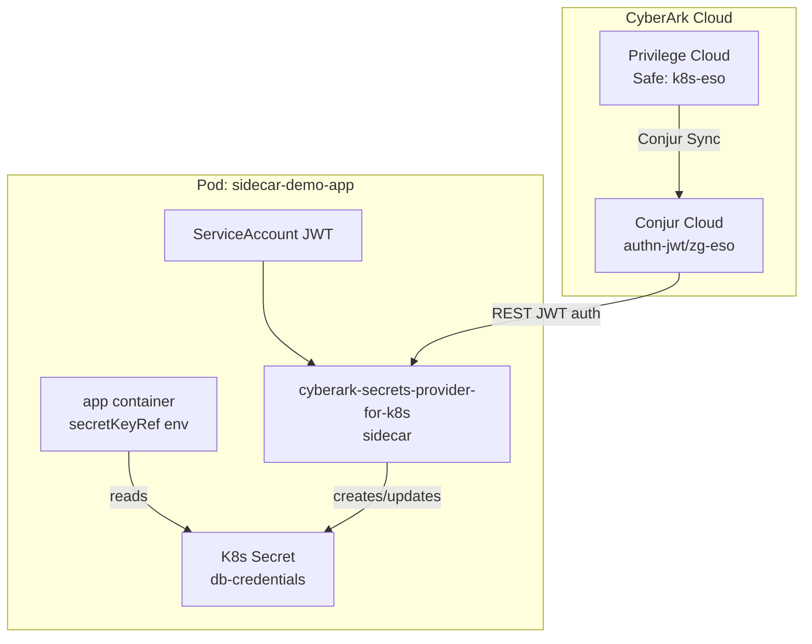

# Secrets Provider Sidecar + CyberArk Conjur Cloud — Demo Validation

Assume `setup.sh` completed successfully. This walkthrough validates the sidecar integration and explains CyberArk behavior.

## Start Here

```bash
kubectl config current-context
kubectl get ns sp-sidecar
kubectl get pods -n sp-sidecar -l app=sidecar-demo-app
```

Expected: one pod with **2/2** containers ready (`app` + `cyberark-secrets-provider-for-k8s`).

## About

| Component | Role |
|---|---|
| **Privilege Cloud** | Source of truth — `k8s-eso` safe, account passwords |
| **Conjur Synchronizer** | Replicates safe contents to Conjur variables |
| **Conjur Cloud** | JWT auth, policy, secret retrieval API |
| **Secrets Provider sidecar** | In-pod agent — JWT auth, fetch, write K8s Secret |
| **K8s ServiceAccount** | `sp-sidecar-sa` — JWT `sub` = Conjur host identity |

## Architecture



## Core Validation

**ConfigMap:**

```bash
kubectl get configmap -n sp-sidecar conjur-connect -o yaml
```

**Secret mapping and populated keys:**

```bash
kubectl get secret -n sp-sidecar db-credentials -o yaml
kubectl get secret -n sp-sidecar db-credentials -o jsonpath="{.data.username}" | base64 --decode && echo
kubectl get secret -n sp-sidecar db-credentials -o jsonpath="{.data.password}" | base64 --decode && echo
```

**App env consumption:**

```bash
POD=$(kubectl get pod -n sp-sidecar -l app=sidecar-demo-app -o jsonpath='{.items[0].metadata.name}')
kubectl exec -n sp-sidecar "$POD" -c app -- printenv DB_USERNAME DB_PASSWORD
```

**Sidecar logs:**

```bash
kubectl logs -n sp-sidecar "$POD" -c cyberark-secrets-provider-for-k8s --tail=50
```

## Identity and Access Controls

| Layer | Control |
|---|---|
| **JWT token** | Projected SA token, audience `conjur` |
| **Conjur host** | `data/poc-workloads/system:serviceaccount:sp-sidecar:sp-sidecar-sa` |
| **Authenticator** | `authn-jwt/zg-eso` — host in `apps` group |
| **Safe access** | `k8s-eso/delegation/consumers` |

## Rotation Behavior

1. Change password in Privilege Cloud for `account-ssh-user-1` in safe `k8s-eso`.
2. Conjur Sync updates Conjur variables.
3. Sidecar refresh (15s) re-fetches and patches `db-credentials`.
4. Validate:

```bash
watch -n 5 'kubectl get secret -n sp-sidecar db-credentials -o jsonpath="{.data.password}" | base64 --decode; echo'
```

Or run the live rotation section in `demo.sh`.

**Note:** `secretKeyRef` environment variables do not update until the app container restarts. For automatic rollout after secret change, see `eso-reloader/`.

## Compare to ESO

| Aspect | Sidecar (`sidecar/`) | ESO (`eso/`) |
|---|---|---|
| Install footprint | Per-pod sidecar image | Cluster-wide ESO + CRDs |
| Configuration | Secret `conjur-map` + annotations | SecretStore + ExternalSecret |
| Secret writer | Provider container | ESO controller |
| Typical buyer story | Minimal deps, co-located with app | GitOps-friendly CRDs, multi-namespace |

## Troubleshooting

| Symptom | Check |
|---|---|
| Pod 1/2 not ready | Sidecar logs; Conjur policy grants |
| Empty `username`/`password` keys | `conjur-map` paths; safe sync status |
| Secret never updates on rotation | `conjur.org/secrets-refresh-enabled`; sidecar logs |
| App shows old password | Expected for env vars — restart pod or use Reloader |

## Interactive Demo

```bash
bash demos/secrets_manager/k8s/sidecar/demo.sh
```
