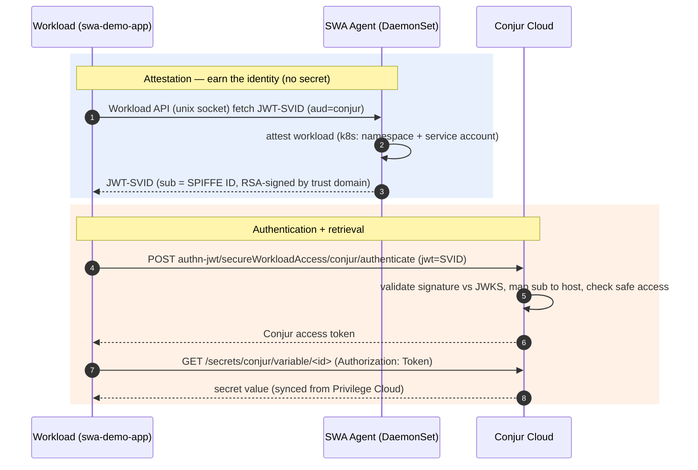
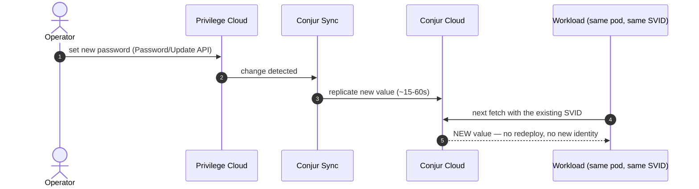
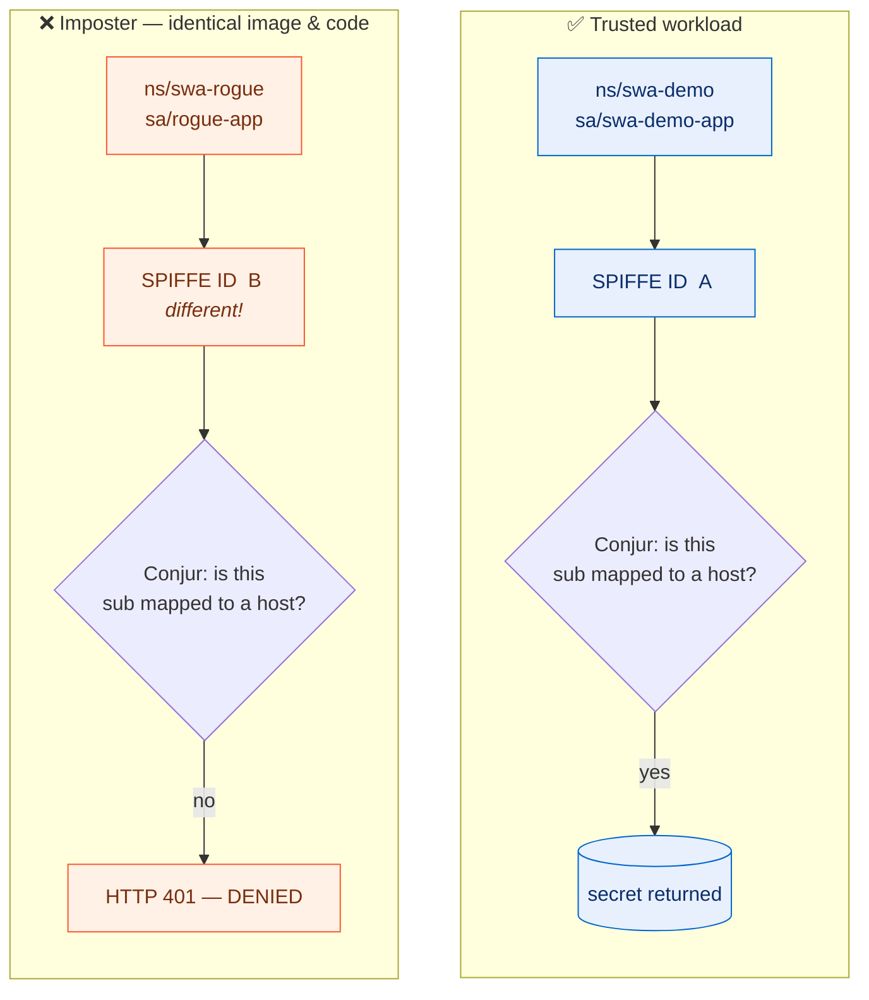

# Demo Validation

Post-install walkthrough for the Secure Workload Access (SWA) demo. Assumes `bash go.sh` has
completed. The goal: prove a Kubernetes workload authenticated to Conjur Cloud with a SPIFFE
JWT-SVID — no API key, no static service-account token — and retrieved a Privilege-Cloud-synced
secret.

## Start Here

```bash
export CYBR_DEMOS_PATH=/path/to/cybr-demos
cd demos/secrets_manager/k8s/swa-minikube
set -a; source setup/vars.env; source swa_demo_lib.sh; swa_demo_init; set +a
bash ready_check.sh
```

`ready_check.sh` confirms the Server, Agent, and workload are healthy and that a secret was
retrieved via JWT-SVID.

## About

| Component | Role |
|-----------|------|
| **SWA Server** (Deployment, `swa-system`) | Registers with Conjur Cloud (control plane). Attests nodes via `k8s_psat` (Kubernetes TokenReview). Issues SVIDs to agents. |
| **SWA Agent** (DaemonSet, `swa-system`) | Runs on each node. Attests workloads via the `k8s` attestor (kubelet). Exposes the SPIFFE Workload API socket on a hostPath so co-located pods can fetch SVIDs. |
| **Conjur Cloud** | The SWA control plane AND the secrets store. `authn-jwt/secureWorkloadAccess` validates workload JWT-SVIDs and returns an access token. |
| **Workload** (`swa-demo-app`, `swa-demo`) | Init container fetches a JWT-SVID from the node-local agent; app container exchanges it for the secret. |

Identity: the workload's SPIFFE ID is `spiffe://<trust-domain>/<node-group>/ns/swa-demo/sa/swa-demo-app`.

## Workflow



> A ground-up visual walkthrough (the problem, SPIFFE vocabulary, and SWA components) lives in
> [demo_setup.md](demo_setup.md#architecture--a-visual-walkthrough-from-the-ground-up).

## Core Validation

```bash
kubectl get pods -n "$SWA_NAMESPACE" -o wide          # swa-server + swa-agent Running
kubectl get ds/swa-agent -n "$SWA_NAMESPACE"          # DESIRED == READY
kubectl get pods -n "$SWA_APP_NAMESPACE"              # swa-demo-app Running (1/1)
```

Proves the control plane (Server) and node-local issuer (Agent) are up and the workload scheduled.

## Pattern 1: Node attestation (k8s_psat)

- **What it does:** the SWA Server trusts an Agent only after validating the Agent's projected
  service-account token via the Kubernetes TokenReview API.
- **Identity / control:** the Agent's SA (`swa-system/swa-agent`) must be on the server group's
  `k8s_psat` allow-list, and the PSAT audience must match (`swa-server`).
- **Validate:**

```bash
kubectl logs -n "$SWA_NAMESPACE" ds/swa-agent | grep -i -E "attest|node|svid" | head
kubectl logs -n "$SWA_NAMESPACE" deploy/swa-server | grep -i -E "attest|agent" | head
```

- **Proves:** only nodes running an allow-listed, attested Agent can obtain SVIDs — the trust root
  is the cluster's own token issuer, not a shared secret.

## Pattern 2: Workload attestation + JWT-SVID

- **What it does:** the Agent identifies the calling pod (namespace + service account) and issues a
  JWT-SVID whose `sub` is the pod's SPIFFE ID.
- **Identity / control:** the node group's SPIFFE template binds identity to `ns/<ns>/sa/<sa>`; a
  different namespace or service account yields a different SPIFFE ID (and no access).
- **Validate:**

```bash
# The init container wrote the SVID into a shared volume. The file shape is:
#   [ { "svids": [ { "spiffe_id": "...", "svid": "<JWT>" } ] } ]
kubectl exec -n "$SWA_APP_NAMESPACE" deploy/swa-demo-app -c app -- cat /spiffe/svid.json

# Extract the raw JWT-SVID, then decode the payload (sub/aud/iss/exp):
SVID=$(kubectl exec -n "$SWA_APP_NAMESPACE" deploy/swa-demo-app -c app -- cat /spiffe/svid.json \
  | jq -r '.. | objects | select(has("svid")) | .svid' | head -1)
echo "$SVID" | cut -d. -f2 | tr '_-' '/+' | base64 -d 2>/dev/null | jq .
# Expect: sub = SPIFFE ID, aud = ["conjur"], exp ~3600s out,
#         iss = https://<sub>.secretsmgr.cyberark.cloud/api/swa/trust-domains/<trust-domain>
```

- **Proves:** the workload holds a short-lived, cryptographically signed identity issued by SWA —
  not a long-lived credential.
- **Note on lifetime:** the init container fetches the SVID once at pod start (TTL from the trust
  domain `token_ttl`, 3600s in this demo). After it expires the app can no longer authenticate until
  the pod restarts — `demo.sh` auto-restarts the workload at the start of a run so the walkthrough is
  always live. In production, a sidecar (e.g. `spiffe-helper`) or the SPIFFE CSI driver refreshes the
  SVID continuously.

## Pattern 3: Secret retrieval via authn-jwt/secureWorkloadAccess

- **What it does:** the app exchanges the JWT-SVID for a Conjur access token and reads the secret.
- **Identity / control:** Conjur validates the SVID against the trust domain JWKS
  (`https://<sub>.secretsmgr.cyberark.cloud/api/swa/trust-domains/<trust-domain>/.well-known/jwks`),
  maps the `sub` claim to the `data/poc-workloads/<spiffe-id>` host (via the
  `authn-jwt/secureWorkloadAccess/sub` annotation), confirms membership in the authenticator `apps`
  group, and confirms `<SAFE_NAME>/delegation/consumers` membership before returning the value.
- **Validate:**

```bash
kubectl logs -n "$SWA_APP_NAMESPACE" deploy/swa-demo-app -c app --tail=5
# -> "retrieved via SWA JWT-SVID -> username=... password=..."
```

- **Proves:** end to end — Privilege Cloud account -> Conjur Sync -> Conjur Cloud -> JWT-SVID auth ->
  secret in the workload, with zero secret material in the image or manifest.

### On-demand retrieval by hand

`demo.sh` step 8 runs this live (using the pod's own SVID, not an operator token):

```bash
SVID=$(kubectl exec -n "$SWA_APP_NAMESPACE" deploy/swa-demo-app -c app -- cat /spiffe/svid.json \
  | jq -r '.. | objects | select(has("svid")) | .svid' | head -1)
CTOKEN=$(curl -s --data-urlencode "jwt=${SVID}" -H "Accept-Encoding: base64" \
  "https://${SM_FQDN}/api/authn-jwt/${SWA_AUTHN_ID}/conjur/authenticate")
curl -s -H "Authorization: Token token=\"${CTOKEN}\"" \
  "https://${SM_FQDN}/api/secrets/conjur/variable/${SM_SECRET_PASSWORD_ID}"   # -> the password
```

## Pattern 4: Live rotation (source-of-truth follows everywhere)

- **What it does:** change the password in Privilege Cloud; Conjur Sync replicates it to Conjur Cloud;
  the running workload reads the new value with no redeploy and no new identity.



- **Validate (what `demo.sh` step 9 automates):**

```bash
itok=$(get_identity_token "$TENANT_ID" "$CLIENT_ID" "$CLIENT_SECRET")
aid=$(get_account_id_by_safe "$TENANT_SUBDOMAIN" "$itok" "$SAFE_NAME")
set_account_password "$TENANT_SUBDOMAIN" "$itok" "$aid" "Rotated-$(date +%s)!"
# Poll Conjur Cloud until the value changes (typically 15-60s), then re-fetch
# via the workload's SVID (see the snippet above) — it returns the new value.
```

- **Proves:** rotation is centralized and automatic. The PAM `Password/Update` API sets the value in
  the Vault directly (no CPM target needed), so the change is immediate; the consumer never holds a
  copy and never needs a restart.

## Pattern 5: The identity boundary (red-team)

`demo.sh` step 10 attacks the system live to prove the boundary is real. You can reproduce both by hand.



Plus a tamper check: flip one character of a genuine SVID's signature and Conjur rejects it (401)
before it even reads policy — the signature no longer verifies against the trust domain's keys.


- **Attack #1 — tamper with the SVID.** Take the genuine SVID, flip one character of its signature,
  and present it to Conjur. The signature no longer verifies against the trust domain's keys, so
  Conjur rejects it (HTTP 401) before evaluating policy.

```bash
SVID=$(kubectl exec -n "$SWA_APP_NAMESPACE" deploy/swa-demo-app -c app -- cat /spiffe/svid.json \
  | jq -r '.. | objects | select(has("svid")) | .svid' | head -1)
FORGED="${SVID%.*}.A${SVID##*.}"   # mangle the signature
curl -s -o /dev/null -w '%{http_code}\n' --data-urlencode "jwt=${FORGED}" \
  -H "Accept-Encoding: base64" \
  "https://${SM_FQDN}/api/authn-jwt/${SWA_AUTHN_ID}/conjur/authenticate"   # -> 401
```

- **Attack #2 — imposter workload.** Deploy the *same image and code* into a different
  namespace/service account. SWA still issues it an SVID, but with a **different SPIFFE ID**
  (`.../ns/swa-rogue/sa/rogue-app`). That `sub` maps to no authorized Conjur host, so authentication
  returns 401 — access is bound to *what the workload is*, not its image. `demo.sh` clones the
  deployment via `kubectl ... -o json | jq | kubectl apply -f -`, shows the side-by-side ALLOW/DENY,
  then deletes the `swa-rogue` namespace.

- **Proves:** a stolen token can't be altered or replayed, and copying the container does not grant
  the copy the original's access. The identity boundary holds at runtime.

## Compare The Patterns

| Pattern | What it secures | Where enforced |
|---------|-----------------|----------------|
| `k8s_psat` node attestation | which nodes/agents are trusted | SWA Server (TokenReview) |
| `k8s` workload attestation | which pod identity is issued | SWA Agent (kubelet) |
| `authn-jwt/secureWorkloadAccess` | which workload can read which secret | Conjur Cloud (policy + safe) |
| identity boundary (red-team) | tampered tokens + imposter workloads are denied | signature verify + `sub`->host mapping |

vs. the other K8s demos in this repo: ESO/sidecar authenticate with the **raw Kubernetes service
account JWT**; SWA inserts an attestation layer and issues a **purpose-built SPIFFE SVID**, decoupling
workload identity from the cluster's SA tokens.

## Troubleshooting

- **No SVID file:** `kubectl describe pod -n "$SWA_APP_NAMESPACE" -l app=swa-demo-app` — the init
  container couldn't reach the agent socket (`/tmp/swa-agent/public/api.sock`) or attestation failed.
  Check `kubectl logs -n "$SWA_NAMESPACE" ds/swa-agent`.
- **authn-jwt failure in app logs:** the app prints the Conjur response. Common causes:
  - `CONJ00016E Token expired` — the init-fetched SVID aged out (>`token_ttl`). Restart the
    workload: `kubectl rollout restart deploy/swa-demo-app -n "$SWA_APP_NAMESPACE"` (or just run
    `demo.sh`, which refreshes automatically).
  - Wrong `jwks-uri`/`issuer` on the authenticator. The verified values for this tenant are
    `https://<sub>.secretsmgr.cyberark.cloud/api/swa/trust-domains/<trust-domain>` (issuer) and that
    URL + `/.well-known/jwks` (JWKS). `enable_swa_authenticator.sh` discovers them via OIDC; override
    with `SWA_TD_JWKS_URI`/`SWA_TD_ISSUER` in `setup/vars.env` and re-run if needed.
  - Missing `apps`-group grant or safe `delegation/consumers` membership.
- **403 on secret:** the workload host isn't in `<SAFE_NAME>/delegation/consumers` yet — the
  Synchronizer may still be catching up, or re-run the grant stage.
- **Server/Agent CrashLoop:** check images loaded (`minikube image ls | grep swa`) and
  `controlPlane.url` / `controlPlane.auth.authnID`.
