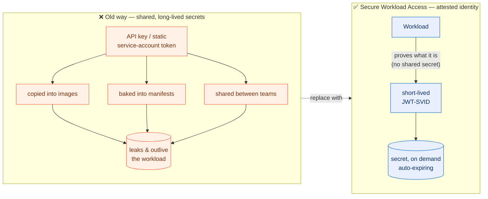
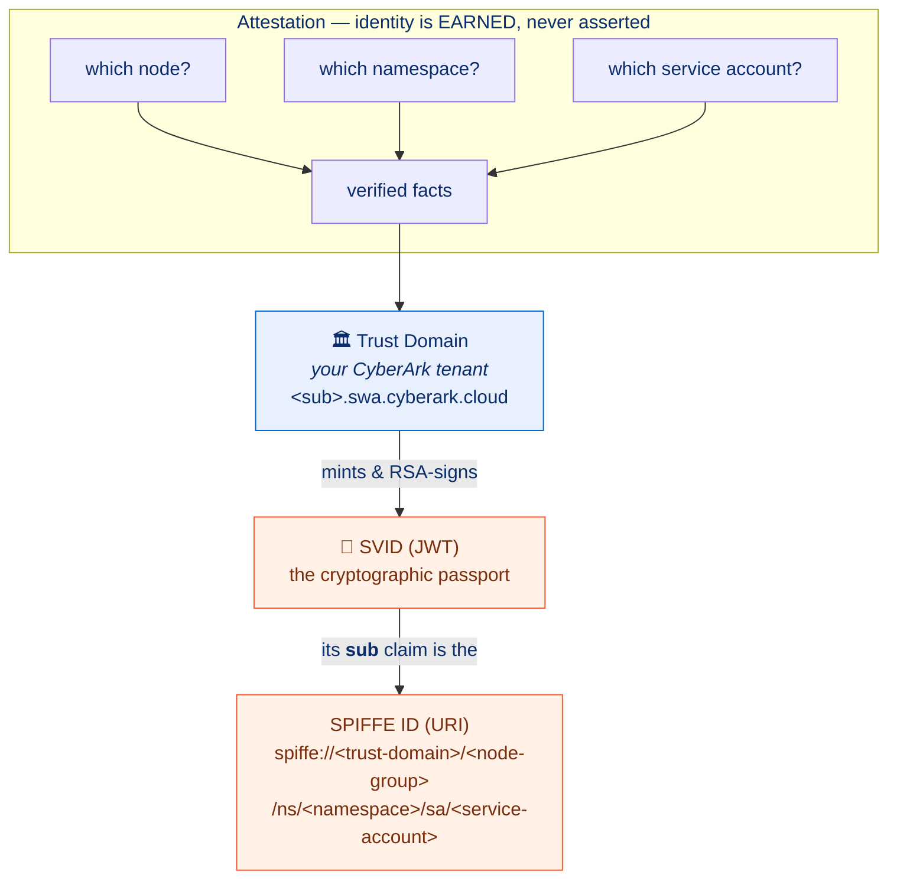
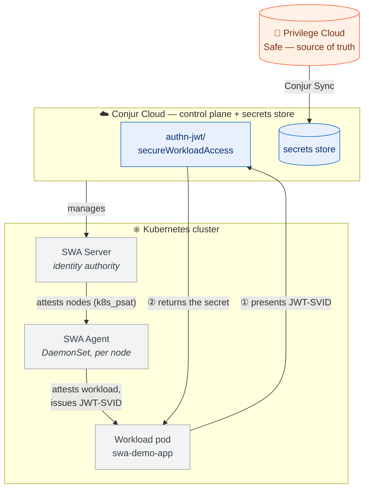
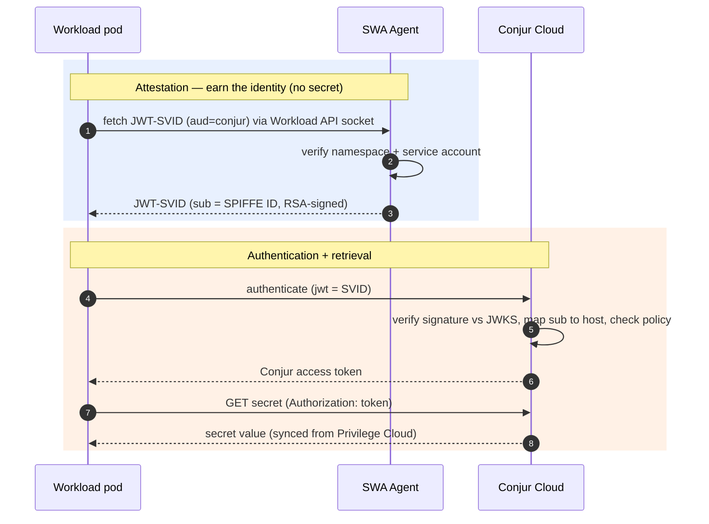

# Demo Setup

How the Secure Workload Access (SWA) Kubernetes demo is deployed in this repo. SWA issues
SPIFFE workload identities in-cluster; a workload fetches a JWT-SVID and exchanges it for a
Conjur Cloud secret synced from Privilege Cloud.

## Architecture — a visual walkthrough (from the ground up)

New to SPIFFE? Start here. Each diagram adds one layer; by the last one you can read the whole flow.

### 1. The problem this solves

The old way hands every workload a long-lived, shared secret and hopes it never leaks. SWA flips the
model: a workload **proves what it is** and gets a short-lived credential — nothing static to steal.



### 2. The SPIFFE vocabulary

Four terms power everything. A **trust domain** (your CyberArk tenant) issues a **SVID** (a signed
JWT — the "passport") whose `sub` claim is the workload's **SPIFFE ID** (a URI naming *who* it is).
The SVID is only granted after **attestation** — the platform verifies real facts about the workload.



### 3. The SWA components

Two components run **inside the cluster**, both managed by Conjur Cloud (the control plane). The
**SWA Server** decides which nodes are trusted; the **SWA Agent** (one per node) attests workloads and
hands out SVIDs over a local socket. The secret itself originates in Privilege Cloud and is mirrored
to Conjur Cloud by **Conjur Sync**.



### 4. The end-to-end flow

Putting it together — attestation (left, no secret involved) then authentication + retrieval (right):



> These diagrams render in Cursor's Markdown preview and on GitHub. The live `demo.sh` walks the same
> flow step by step; `demo_validation.md` adds the rotation and identity-boundary diagrams.

## Main Entry Point

```bash
export CYBR_DEMOS_PATH=/path/to/cybr-demos
cd demos/secrets_manager/k8s/swa

cp setup/vars.env.example setup/vars.env   # edit values
bash check_prereqs.sh
bash go.sh
```

`go.sh` (alias: `setup.sh`) is the one-shot bootstrap. It is staged and idempotent — re-running
converges. Individual stage scripts under `setup/` can also be run on their own.

## Deployment Context

- **Target platform:** local **minikube** (`minikube start --driver=docker`) as the current
  kubectl context. The SWA Server and Agent run **in-cluster**; Conjur Cloud is the SWA control plane.
- **Images:** the demo loads the release's container images with `minikube image load`
  (`swa-server:1.0.0-<arch>`, `swa-agent:1.0.0-<arch>`). On a non-minikube context the load step is
  skipped with a warning — you must make the images reachable from your nodes yourself.
- **SWA control-plane objects** (trust domain, server group, node group, server) are created with the
  release's `terraform-provider-swa`, staged into a local filesystem mirror so `terraform init` works
  offline. Everything Conjur-side (authenticator, workload host, grants, safe, sync) uses the repo's
  shared bash helpers in `demos/utility/ubuntu/`.
- This is platform-generic in concept (SWA also runs on VMs, EKS, OpenShift). Only the minikube
  image-load path and the `k8s_psat` cluster name (`minikube`) are lab-specific.

## Required Environment

Shared (assumed already set):

- `CYBR_DEMOS_PATH` points at the repo root.
- `demos/tenant_vars.sh` provides `TENANT_ID`, `TENANT_SUBDOMAIN`, `CLIENT_ID`, `CLIENT_SECRET`.

Demo config — single source of truth is `setup/vars.env` (copy from `setup/vars.env.example`):

- `SAFE_NAME`, `SM_SECRET_USERNAME_ID`, `SM_SECRET_PASSWORD_ID` — the synced credential.
- `SWA_TRUST_DOMAIN`, `SWA_SERVER_GROUP`, `SWA_NODE_GROUP`, `SWA_CLUSTER_NAME` — SPIFFE topology.
- `SWA_CONTROL_PLANE_URL` — SWA control plane (default `https://<subdomain>.secretsmgr.cyberark.cloud`).
- `SWA_AUTHN_ID` (`secureWorkloadAccess`), `SWA_JWT_AUDIENCE` (`conjur`).
- `SWA_TD_JWKS_URI` / `SWA_TD_ISSUER` — leave blank to auto-discover; override if discovery fails.
- `SWA_RELEASE_DIR` / `SWA_RELEASE_ZIP` — where the downloaded release zip lives.

Tools required: `kubectl`, `helm`, `terraform`, `jq`, `curl`, `unzip`, and `minikube`.

Optional (recommended): [`gum`](https://github.com/charmbracelet/gum) — `demo.sh` uses it for the
polished, panelled presentation (bordered cards, markdown narrative, colored status). Install with
`brew install gum`. Without it, `demo.sh` automatically falls back to plain ANSI output.

The SWA release zip (`Secure Workload Access_1.0_*.zip`, ~195MB) must be downloaded from the CyberArk
Marketplace; it is never committed to the repo.

## Setup Flow

`go.sh` runs six stages:

1. **Stage release** — `setup/swa/load_release.sh`: extract the zip, `minikube image load` both images,
   stage the terraform provider mirror + `.terraformrc`.
2. **Vault** — `setup/vault/setup.sh`: create the Privilege Cloud safe + `account-ssh-user-1`, add
   `Conjur Sync`, wait for the Synchronizer to replicate the safe to Conjur Cloud.
3. **Register** — `setup/swa/register.sh`: `terraform apply` to create the trust domain (RSA signing),
   server group (`k8s_psat`, cluster `minikube`), node group (kubernetes SPIFFE template), and the
   server registration (inline `public_keys` from the cluster OIDC). Writes `server_authn_id`.
4. **Install** — `setup/swa/install_server.sh` then `install_agent.sh`: render values and
   `helm upgrade --install` the SWA Server (Deployment) and Agent (DaemonSet) into `swa-system`.
5. **Configure Conjur** — `setup/conjur/enable_swa_authenticator.sh`: define + activate
   `authn-jwt/secureWorkloadAccess`, set its `jwks-uri`/`issuer`/`token-app-property`/`identity-path`,
   create the workload host with its SPIFFE `sub` annotation, grant authenticator + safe access.
6. **Workload** — `setup/swa/deploy_workload.sh`: render + apply the `swa-demo` namespace, service
   account, and the demo Deployment.

## What Gets Deployed

- Namespace `swa-system`: `swa-server` Deployment + Service, `swa-agent` DaemonSet, RBAC, config.
- Namespace `swa-demo`: `swa-demo-app` Deployment (init container fetches a JWT-SVID; app container
  exchanges it for the secret) and its service account.
- Conjur Cloud: `authn-jwt/secureWorkloadAccess` authenticator, `data/poc-workloads` host for the
  workload SPIFFE ID, grants into the authenticator `apps` group and the safe `delegation/consumers`.
- SWA control plane: trust domain, server group, node group, server (via terraform).
- Privilege Cloud: the demo safe + `account-ssh-user-1`, replicated by Conjur Sync.

## Troubleshooting Setup

- **Release not found:** set `SWA_RELEASE_ZIP` or drop the zip in `SWA_RELEASE_DIR`.
- **Images not loaded:** confirm the current context is `minikube` and `minikube image ls | grep swa`.
- **`terraform init` fails:** ensure `setup/swa/load_release.sh` ran (it writes `.terraformrc` +
  the provider mirror); the provider binary must match your OS/arch.
- **Server not Ready:** `kubectl logs -n swa-system deploy/swa-server` — usually `controlPlane.url`
  or `controlPlane.auth.authnID` (terraform `server_authn_id`) is wrong for the tenant.
- **Agent not Ready / no SVIDs:** `kubectl logs -n swa-system ds/swa-agent` — check node attestation
  (`k8s_psat` cluster name must match the server group) and that the agent SA is allow-listed.
- **Authenticator config (v1.0):** `SWA_TD_JWKS_URI` / `SWA_TD_ISSUER` may need to be set explicitly
  if OIDC discovery fails — `enable_swa_authenticator.sh` prints the values it used. See
  [setup/swa/README.md](setup/swa/README.md).
