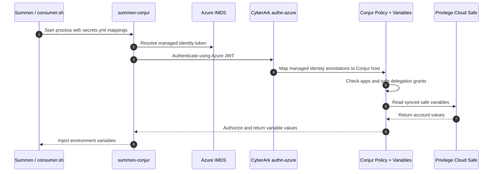

# Demo: Summon Azure Auth

This demo shows Summon on an Azure-hosted Ubuntu VM retrieving secrets from CyberArk Secrets Manager by authenticating with Azure managed identity instead of a rotated Conjur API key.

Use the repo-standard docs for deployment and validation:

- `demo_setup.md`
- `demo_validation.md`

Official and project references for this use case:

- [Authenticate Azure resources](https://docs.cyberark.com/secrets-manager-saas/latest/en/content/operations/authn/authenticate-azure-overview.htm?tocpath=Authenticate%20workloads%7CSecure%20cloud%20workloads%7CAuthenticate%20Azure%20resources%7C_____1)
- [Summon Conjur provider](https://github.com/cyberark/summon-conjur)
- [CyberArk Azure managed identity example](https://developer.cyberark.com/blog/using-cyberark-conjur-with-azure-serverless-functions-and-managed-identities/)

## About

- `Summon` starts a child process and injects secrets as environment variables.
- `summon-conjur` authenticates that process to CyberArk using `authn-azure`.
- `authn-azure` validates an Azure managed identity token and maps it to a Conjur host.
- Conjur authorizes that host through the `authn-azure/<service-id>/apps` group and the safe delegation group.
- `consumer.sh` prints the injected values to prove the secrets were delivered to the process.

## Workflow

## Key Files

- `PLAN.md`
  Tracks build/lab-test progress and the workshop delivery design.
- `setup_vm.sh`
  VM orchestrator the deployment app runs: repo → `setup.sh` → `activity/db_setup.sh` → docker/psql → `activity/setup_activity.sh`.
- `setup.sh`
  Deployment enablement: installs Summon, validates the tenant PostgreSQL platform, provisions/configures the Azure authenticator + workload identity, and renders `secrets.yml`. Does NOT create the safe.
- `setup/conjur/setup.sh`
  Creates the `authn-azure` service if needed, sets `provider-uri`, grants the workload, validates Azure IMDS, and writes `conjur_authn_azure.env`.
- `setup/conjur/grant_consumers.sh`
  Grants the workload read access to the safe's consumers group — run after the student creates the safe and it syncs.
- `activity/db_setup.sh`
  Stands up the VM-local Postgres container with the initial credential and seeds the demo table.
- `activity/setup_activity.sh`
  Renders the per-student workspace (hardcoded/secured `psql` scripts + pre-filled `secrets.yml`).
- `setup/vars.env`
  Shared config: `SAFE_NAME` (defaults to the VM name), Azure authenticator service id, `POSTGRES_PLATFORM_ID`, and Azure identity details.
- `demo.sh` / `consumer.sh`
  Post-vault smoke test: retrieves the vaulted Postgres credential via Summon and shows it was injected (`PGUSER` present, `PGPASSWORD` length).
- `secrets.tmpl.yml`
  Template for the post-vault smoke-test `!var` paths (`postgres-appuser`).
- `test_runner.sh`
  Non-interactive validation of the activity setup (orchestrator + hardcoded query).
