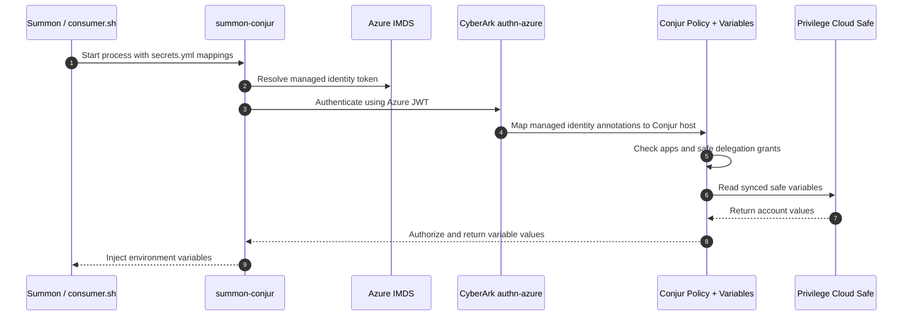

# Demo: Summon Azure Auth

This demo shows Summon on an Azure-hosted Ubuntu VM retrieving secrets from CyberArk Secrets Manager by authenticating with Azure managed identity instead of a rotated Conjur API key.

Use the repo-standard docs for deployment and validation:

- `demo_setup.md`
- `demo_validation.md`

Official and project references for this use case:

- [Authenticate Azure resources](https://docs.cyberark.com/secrets-manager-saas/latest/en/content/operations/authn/authenticate-azure-overview.htm?tocpath=Authenticate%20workloads%7CSecure%20cloud%20workloads%7CAuthenticate%20Azure%20resources%7C_____1)
- [Summon Conjur provider](https://github.com/cyberark/summon-conjur)
- [CyberArk Azure managed identity example](https://developer.cyberark.com/blog/using-cyberark-conjur-with-azure-serverless-functions-and-managed-identities/)

## About

- `Summon` starts a child process and injects secrets as environment variables.
- `summon-conjur` authenticates that process to CyberArk using `authn-azure`.
- `authn-azure` validates an Azure managed identity token and maps it to a Conjur host.
- Conjur authorizes that host through the `authn-azure/<service-id>/apps` group and the safe delegation group.
- `consumer.sh` prints the injected values to prove the secrets were delivered to the process.

## Workflow

## Key Files

- `PLAN.md`
  Tracks build and lab-test progress.
- `setup.sh`
  Installs Summon, provisions the safe, provisions/configures the Azure authenticator and workload, and renders `secrets.yml`.
- `setup/vault/setup.sh`
  Creates the demo safe, grants required members, and creates `account-ssh-user-1`.
- `setup/conjur/setup.sh`
  Creates the `authn-azure` service if needed, sets `provider-uri`, grants the workload, validates Azure IMDS, and writes `conjur_authn_azure.env`.
- `setup/vars.env`
  Shared demo configuration for safe name, Azure authenticator service ID, and Azure managed identity details.
- `demo.sh`
  Loads the runtime environment, validates Azure metadata access, and runs Summon.
- `consumer.sh`
  Prints the injected variables so the retrieval result is visible.
- `secrets.tmpl.yml`
  Template for the safe-backed `!var` paths.
- `test_runner.sh`
  Runs setup and validation non-interactively and captures artifacts.
