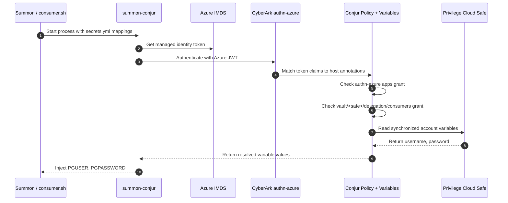

# Summon Azure Auth Validation

This validation guide assumes the demo is already installed and that `./setup.sh` has completed successfully.

## Start Here

Work from the demo directory:

```bash
cd demos/secrets_manager/summon_azure_auth
```

Load the runtime environment generated during setup:

```bash
source ./conjur_authn_azure.env
```

This demo proves that a local Linux process can authenticate to CyberArk with Azure managed identity, map that Azure identity to a Conjur host, and retrieve safe-backed variables through Summon without using a Conjur API key.

> This validates the **post-vault secured path**. It requires the student to have
> already vaulted the `postgres-appuser` account into the safe (named after the
> VM) and the workload to have been granted access
> (`setup/conjur/grant_consumers.sh`). To validate only the activity *setup*
> (through the hardcoded query), run `bash ./test_runner.sh`.

## About

The main components are:

- `Summon`
  Starts the target process and injects variables from `secrets.yml`.
- `summon-conjur`
  Authenticates the process to CyberArk and resolves each `!var` path.
- `authn-azure`
  Validates the Azure managed identity token and maps it to the configured Conjur host.
- `Conjur`
  Enforces policy and serves the synchronized variable values.
- `Privilege Cloud safe`
  Holds the source account that was synchronized into Conjur.

The important CyberArk controls in this demo are:

- the Azure token must come from the expected tenant, subscription, resource group, and user-assigned identity
- the derived Conjur host must belong to the `authn-azure/<service-id>/apps` group
- the same workload group must belong to `vault/<safe-name>/delegation/consumers`

If either grant is missing, the flow breaks in a predictable way:

- missing `authn-azure` grant: authentication fails
- missing safe delegation grant: authentication succeeds, but variable lookup fails

## Workflow



Read the diagram left to right:

1. `demo.sh` starts Summon with the rendered `secrets.yml`.
2. `summon-conjur` authenticates through `authn-azure`, not through `authn` with an API key.
3. CyberArk maps the Azure managed identity to the Conjur host in `conjur_authn_azure.env`.
4. Conjur enforces both authentication and safe-consumer authorization.
5. The resolved values are injected only into the lifetime of `consumer.sh`.

## Core Validation

Confirm the runtime variables are loaded:

```bash
env | grep -E '^(CONJUR_APPLIANCE_URL|CONJUR_ACCOUNT|CONJUR_AUTHN_TYPE|CONJUR_SERVICE_ID|WORKLOAD_HOST_ID|AZURE_)' | sort
```

Confirm the VM can obtain an Azure managed identity token from IMDS:

```bash
resource="$(jq -rn --arg v "${AZURE_IMDS_RESOURCE:-https://management.azure.com/}" '$v|@uri')"
url="http://169.254.169.254/metadata/identity/oauth2/token?api-version=2018-02-01&resource=${resource}"
if [ -n "${AZURE_CLIENT_ID:-}" ]; then
  client_id="$(jq -rn --arg v "$AZURE_CLIENT_ID" '$v|@uri')"
  url="${url}&client_id=${client_id}"
fi
curl -fsS -H Metadata:true "$url" | jq '{client_id, resource, token_type, expires_on}'
```

Inspect the resolved Summon mapping:

```bash
cat ./secrets.yml
```

Run the demo:

```bash
./demo.sh
```

Success looks like this:

- IMDS returns a token for the expected managed identity
- `CONJUR_AUTHN_TYPE` is `azure`
- `secrets.yml` points to `data/vault/<safe-name>/postgres-appuser/...`
- `demo.sh` prints the Conjur appliance, service ID, and host ID
- `consumer.sh` prints `PGUSER` and confirms `PGPASSWORD` was injected (length shown)

What this proves:

- the host is using Azure managed identity authentication rather than a static Conjur credential
- the Azure identity matches the workload identity CyberArk expects
- the safe synchronization and Conjur authorization path are both working
- Summon injects the secrets into the child process at runtime

## Pattern 1: Azure Managed Identity Mapping

This pattern proves how CyberArk decides who the workload is.

What identity and access controls matter:

- `provider-uri` points to the Azure tenant issuer
- the host annotations match the Azure subscription, resource group, and user-assigned identity name
- the workload group is a member of the `authn-azure` `apps` group

Validate the mapping inputs:

```bash
printf '%s\n' "$AZURE_PROVIDER_URI"
printf '%s\n' "$AZURE_SUBSCRIPTION_ID"
printf '%s\n' "$AZURE_RESOURCE_GROUP"
printf '%s\n' "$AZURE_USER_ASSIGNED_IDENTITY_NAME"
printf '%s\n' "$WORKLOAD_HOST_ID"
printf '%s\n' "$CONJUR_AUTHN_URL"
```

What the result proves:

- setup captured the intended Azure identity metadata
- the runtime is targeting the correct `authn-azure` service
- the generated Conjur host path matches the policy created during setup

CyberArk behavior:

- `summon-conjur` obtains or accepts an Azure managed identity token
- CyberArk verifies the token through `authn-azure`
- CyberArk compares the token identity to the host annotations
- the request can continue only if the host's workload group was granted membership in the `apps` group

## Pattern 2: Safe-Backed Secret Retrieval Through Summon

This pattern proves how the authenticated workload reads synchronized variables from the safe.

What identity and access controls matter:

- the same workload group must be in `vault/<safe-name>/delegation/consumers`
- the rendered `!var` paths must point to the synchronized safe variables

Validate the secret map and run the retrieval:

```bash
cat ./secrets.yml
./demo.sh
```

If `SUMMON_AZURE_FETCH_TOKEN` is `false` and you want to call Summon directly, this equivalent command leaves Azure token retrieval to `summon-conjur`:

```bash
summon --provider summon-conjur -f ./secrets.yml bash ./consumer.sh
```

What the result proves:

- the demo safe synchronized into Conjur under `data/vault/<safe-name>`
- the workload is authorized to read the synchronized variables
- Summon can inject the resolved values into an ordinary shell process

CyberArk behavior:

- Conjur resolves each `!var` entry in `secrets.yml`
- the values come from safe synchronization, not from a local file or static variable set in the host shell
- the consumer process receives the secrets as environment variables only while that process runs

## Compare The Patterns

- Pattern 1 explains authentication: who the workload is and why CyberArk trusts it.
- Pattern 2 explains authorization and delivery: what that workload can read and how the values reach the process.

Both must succeed for the demo to work. Authentication alone is not enough if the safe delegation grant is missing.

## Troubleshooting

- If IMDS token retrieval fails, confirm the VM is in Azure and the user-assigned identity is attached.
- If the VM has more than one user-assigned identity, set `AZURE_CLIENT_ID`.
- If Summon cannot retrieve a token from metadata, set `SUMMON_AZURE_FETCH_TOKEN="true"` in `setup/vars.env`, re-run setup, and retry `demo.sh`.
- If authentication fails, compare the configured resource group and managed identity name with the Azure resource. The user-assigned identity name is case-sensitive.
- If authentication succeeds but Summon cannot resolve variables, inspect `secrets.yml` and confirm the safe name matches the synchronized safe.
- If secret lookup fails after a safe change, confirm `postgres-appuser` still exists in the safe and that synchronization has completed.
- For a full unattended validation run with captured logs, execute `bash ./test_runner.sh`.
