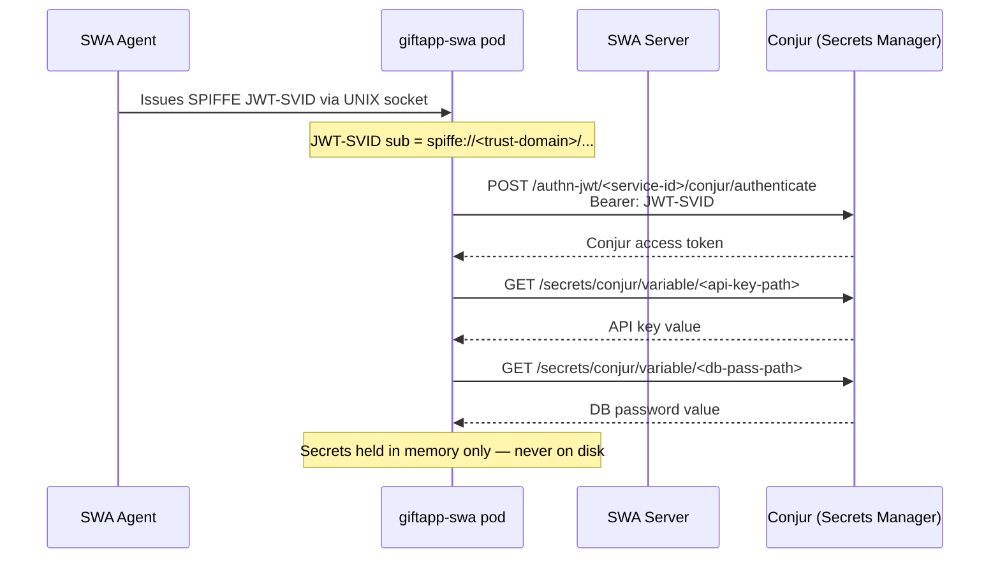

# SWA K8s — Demo Validation

After running `setup.sh`, use this guide to verify the deployment and walk through the demo narrative.

For the fastest machine-checkable validation, run:

```bash
bash validate.sh
```

By default, `validate.sh` restarts only `giftapp-swa` before the final health check. That forces a fresh SWA JWT-SVID and Conjur authentication so the run produces a current audit event for the workload SPIFFE ID. For a non-disruptive health-only check, run:

```bash
FORCE_FRESH_SWA_AUTH=false bash validate.sh
```

For full setup plus validation with captured logs and Kubernetes artifacts, run:

```bash
bash test_runner.sh
```

## Quick status check

```bash
source setup/vars.env
kubectl get pods -n "${SWA_NAMESPACE:-swa-system}"
kubectl get pods -n "$NAMESPACE_HARDCODED"
kubectl get pods -n "$NAMESPACE_SWA"
```

Expected: all pods `Running`.

---

## Attack scenario — `giftapp-hardcoded`

### What to show

The app stores its API key and database password in a Kubernetes Secret, mounted as files at `/etc/secrets/`. Any process or user with pod exec access can read them directly.

### Validation commands

**Attack surface 1 — secret files in the pod:**
```bash
kubectl exec -n "$NAMESPACE_HARDCODED" deploy/giftapp-hardcoded \
  -- sh -c 'echo "API KEY:"; cat /etc/secrets/GIFTAPP_API_KEY; echo; echo "DB PASS:"; cat /etc/secrets/DB_PASS'
```

**Attack surface 2 — RBAC allows reading the K8s Secret via API:**
```bash
SA_TOKEN=$(kubectl exec -n "$NAMESPACE_HARDCODED" deploy/giftapp-hardcoded \
  -- cat /var/run/secrets/kubernetes.io/serviceaccount/token)

kubectl get secret giftapp-hardcoded-secrets \
  -n "$NAMESPACE_HARDCODED" \
  --token="$SA_TOKEN" \
  -o jsonpath='{.data}' | jq 'to_entries[] | "\(.key): \(.value | @base64d)"' -r
```

**The secret exists in etcd — visible with admin access:**
```bash
kubectl get secret giftapp-hardcoded-secrets -n "$NAMESPACE_HARDCODED" \
  -o jsonpath='{.data.GIFTAPP_API_KEY}' | base64 -d
```

### Key talking points

- Static secrets in K8s Secrets are base64-encoded, not encrypted at rest (unless etcd encryption is configured)
- RBAC grants the app's service account read access — it can query the secret directly
- If the pod is compromised, the attacker has the secret with zero extra effort
- Rotation requires redeploying the pod

---

## Defend scenario — `giftapp-swa`

### What to show

The SWA Agent attests the workload and issues a short-lived SPIFFE JWT-SVID. The app exchanges that SVID for secrets from Conjur at startup. No sensitive values exist in the pod spec or mounted volumes.

### Sequence diagram



### Validation commands

**Confirm no sensitive secret files in the pod:**
```bash
kubectl exec -n "$NAMESPACE_SWA" deploy/giftapp-swa -- ls /etc/secrets/
```
Expected output: only `DB_USER`, `DB_HOST`, `DB_PORT`, `DB_NAME` — no password or API key.

**Confirm the SPIFFE socket is mounted:**
```bash
kubectl exec -n "$NAMESPACE_SWA" deploy/giftapp-swa -- ls -l /tmp/swa-agent/public/api.sock
```
Expected: `api.sock`

**Show the ConfigMap (non-sensitive Conjur identifiers):**
```bash
kubectl get configmap giftapp-swa-config -n "$NAMESPACE_SWA" -o yaml
```

**Show SWA Agent is running in the cluster:**
```bash
kubectl get daemonset swa-agent -n "${SWA_NAMESPACE:-swa-system}" -o wide
kubectl logs -n "${SWA_NAMESPACE:-swa-system}" -l app.kubernetes.io/name=swa-agent --tail=30
```

**Show SWA Server is running:**
```bash
kubectl get deployment swa-server -n "${SWA_NAMESPACE:-swa-system}"
kubectl logs -n "${SWA_NAMESPACE:-swa-system}" deploy/swa-server --tail=30
```

**Confirm app fetched secrets at startup (logs show successful Conjur auth):**
```bash
kubectl logs -n "$NAMESPACE_SWA" deploy/giftapp-swa --tail=30
```

To force a fresh audit event, restart the defended app and then check the logs:

```bash
kubectl rollout restart -n "$NAMESPACE_SWA" deploy/giftapp-swa
kubectl rollout status -n "$NAMESPACE_SWA" deploy/giftapp-swa --timeout=180s
kubectl logs -n "$NAMESPACE_SWA" deploy/giftapp-swa --tail=80
```

**Confirm app health reports SWA readiness:**
```bash
kubectl exec -n "$NAMESPACE_SWA" deploy/giftapp-swa -- \
  wget -qO- --no-check-certificate https://127.0.0.1:8443/healthz | jq .
```

Expected fields:

```json
{
  "mode": "swa",
  "secrets": {
    "dbPassword": "present",
    "giftappApiKey": "present"
  },
  "swaReady": true
}
```

---

## Side-by-side comparison

| Property | giftapp-hardcoded | giftapp-swa |
|----------|-------------------|-------------|
| Secrets in pod spec | Yes (K8s Secret mount) | No |
| Readable via pod exec | Yes (`cat /etc/secrets/*`) | No |
| Readable via K8s API | Yes (RBAC grants SA read) | No |
| Credential lifetime | Until Secret is deleted/rotated | Short-lived JWT-SVID (~5 min) |
| Rotation requires pod restart | Yes | No |
| Workload identity | None | SPIFFE ID tied to the workload unix UID |

---

## Troubleshooting

**giftapp-swa pod is in CrashLoopBackOff:**
```bash
kubectl logs -n "$NAMESPACE_SWA" deploy/giftapp-swa --previous
```
Check that the SPIFFE socket path matches `SWA_SOCKET_PATH` in `vars.env` and that the `swa-agent` DaemonSet is running on the same node.

**SWA Agent not attesting:**
```bash
kubectl logs -n "${SWA_NAMESPACE:-swa-system}" -l app.kubernetes.io/name=swa-agent --tail=50
```
Verify:

- `SWA_CLUSTER_NAME` matches the cluster name configured in Terraform and Helm.
- Helm set `nodeAttestor.k8s_psat.audience=spire-server`.
- The RKE2 agent image tag includes the architecture suffix, for example `0.0.0-SNAPSHOT-amd64`.

If logs show policy errors such as `no such attribute(s): unix`, the node group is using an old unix selector. This demo uses Kubernetes workload attributes, matching the `giftapp-swa` namespace and service account.

If logs show Kubernetes attribute mismatches, confirm `NAMESPACE_SWA` and `GIFTAPP_SWA_SERVICE_ACCOUNT` match the deployed `giftapp-swa` pod.

**Conjur authentication failure in giftapp-swa:**
```bash
kubectl logs -n "$NAMESPACE_SWA" deploy/giftapp-swa 2>&1 | grep -i "conjur\|authn\|error"
```
Check that the JWT authenticator is enabled in Conjur and that the SPIFFE ID matches the workload registration policy.

Also verify the authenticator issuer and JWKS URI use the tenant SWA issuer, not `api.venafi.cloud`:

```text
https://<tenant>.secretsmgr.cyberark.cloud/api/swa/trust-domains/<trust-domain>
https://<tenant>.secretsmgr.cyberark.cloud/api/swa/trust-domains/<trust-domain>/.well-known/jwks
```

The JWT-SVID claims logged by `giftapp-swa` should show:

```text
aud=[conjur]
iss=https://<tenant>.secretsmgr.cyberark.cloud/api/swa/trust-domains/<trust-domain>
sub=spiffe://<trust-domain>/<node-group>/workload/<namespace>/giftapp-swa-sa
```

**GiftApp image pull failures:**
```bash
kubectl describe pod -n "$NAMESPACE_SWA" -l app=giftapp-swa
```

For local image imports, confirm:

- `setup/k8s/build_giftapp_images.sh` has run.
- `setup/k8s/giftapp_images.env` exists.
- Helm uses `image.pullPolicy=IfNotPresent`.
- The image is present in RKE2/containerd:
  ```bash
  sudo /var/lib/rancher/rke2/bin/ctr --address /run/k3s/containerd/containerd.sock -n k8s.io images ls | grep giftapp
  ```

**Terraform apply fails:**
```bash
cd setup/swa/terraform
terraform show
```
Confirm `demos/tenant_vars.sh` is filled in and the EC2 host can reach Secrets Manager.
