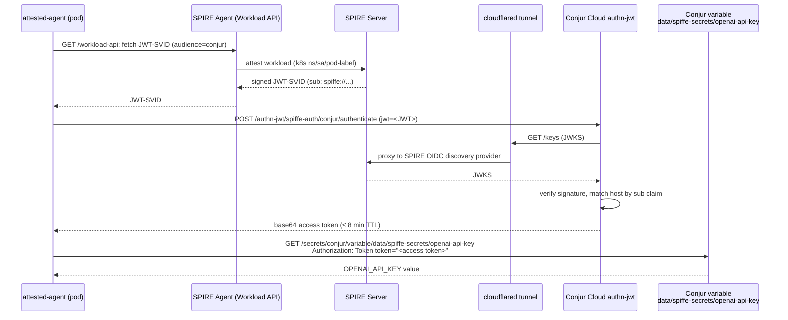

# Demo Validation

This demo proves that an AI agent can authenticate to **CyberArk Conjur Cloud
via SPIFFE JWT-SVID** and retrieve a vaulted secret without ever holding a
long-lived credential. The interactive walkthrough is `./demo.sh`. This
document is for validating that the deployed environment is healthy and
understanding what each pattern does.

## Start Here

```bash
cd $CYBR_DEMOS_PATH/demos/secure_ai_agents/spiffe_conjur
source setup/vars.env

kubectl --context $MINIKUBE_PROFILE get ns vulnerable-agents workloads spire-mgmt
```

You should see all three namespaces. If not, run `./setup.sh` first.

## About

| Component | Role in this demo |
|---|---|
| **SPIRE Server** (`spire-mgmt`) | Workload-CA. Issues X.509 + JWT SVIDs after attesting node + workload. |
| **SPIRE Agent** (DaemonSet) | Per-node attestor (`k8s_psat`) and workload attestor (`k8s`). |
| **SPIFFE CSI Driver** | Mounts the agent's Workload API socket into pods — no Secret, no hostPath. |
| **SPIRE OIDC Discovery Provider** | Serves `/keys` (JWKS) so external systems can verify JWT-SVID signatures. |
| **cloudflared** | Tunnels the in-cluster OIDC service to a public HTTPS URL Conjur Cloud can reach. |
| **CyberArk Conjur Cloud authn-jwt** | Validates the JWT-SVID against SPIRE's JWKS, looks up the host by `sub` claim, returns a short-lived access token. |
| **`vulnerable-agent` pod** | The BEFORE state. Hardcoded API key in env via a K8s Secret. |
| **`attested-agent` pod** | The AFTER state. Zero secrets in spec. Fetches JWT-SVID, exchanges for Conjur token, retrieves vaulted secret. |

## Workflow



## Core Validation

Confirm the SPIRE control plane is healthy:

```bash
kubectl --context $MINIKUBE_PROFILE -n spire-mgmt get pod
```

All pods should be `Running`. If `spire-server-0` is not ready, `kubectl
describe` it and check the StatefulSet.

Confirm the workload identity policy is reconciled:

```bash
kubectl --context $MINIKUBE_PROFILE get clusterspiffeid workloads-default
```

Confirm both demo pods exist:

```bash
kubectl --context $MINIKUBE_PROFILE get pod -n vulnerable-agents vulnerable-agent
kubectl --context $MINIKUBE_PROFILE get pod -n workloads $ATTESTED_AGENT_NAME
```

Confirm the cloudflared tunnel is running and the JWKS endpoint is reachable:

```bash
setup/oidc/setup.sh --status
source setup/.oidc.env
curl -sf "$OIDC_JWKS_URL" | jq .keys[0]
```

Confirm the Conjur Cloud authenticator is enabled:

```bash
identity_token=$(get_identity_token "$TENANT_ID" "$CLIENT_ID" "$CLIENT_SECRET")
conjur_token=$(get_conjur_token "$TENANT_SUBDOMAIN" "$identity_token")
curl -sS -H "Authorization: Token token=\"$conjur_token\"" \
  "https://$TENANT_SUBDOMAIN.secretsmgr.cyberark.cloud/api/authn-jwt/$CONJUR_AUTHN_SERVICE_ID/conjur/status"
```

A 200 with `{"status":"ok"}` means the authenticator is configured correctly.

## Pattern 1 — BEFORE: Hardcoded API Key (Vulnerable)

What it does: a `Pod` whose container env includes `OPENAI_API_KEY` sourced
from a Kubernetes `Secret`. This is the default shape of an AI agent today.

What identity is presented to CyberArk: **none**. The pod has no CyberArk
identity. The "credential" is a static string baked into the platform.

What policy decides access: **the K8s Secret is readable to anyone with
`get/exec` rights on the namespace**. There is no further authorization.

Validate the leak surface:

```bash
# Key in pod spec (any kubectl get pod sees it via secretKeyRef)
kubectl --context $MINIKUBE_PROFILE get pod -n vulnerable-agents vulnerable-agent -o yaml \
  | grep -A1 secretKeyRef

# Key in etcd-backed Secret (base64, not encrypted unless KMS is on)
kubectl --context $MINIKUBE_PROFILE get secret -n vulnerable-agents openai-credentials \
  -o jsonpath='{.data.api-key}' | base64 -d ; echo

# Key in container env (any exec leaks it)
kubectl --context $MINIKUBE_PROFILE exec -n vulnerable-agents vulnerable-agent -- env \
  | grep OPENAI
```

What this proves: the credential exists in **at least three places** the
attacker can reach (pod spec, etcd, container env), and there is no audit
trail when one of those places is read.

What CyberArk is doing: **nothing — there is no integration in this pattern.**
That is the point. This pod is the baseline you are replacing.

## Pattern 2 — AFTER: SPIFFE-attested Agent + Conjur authn-jwt

What it does: the same workload, deployed without any secret in its spec. It
fetches a JWT-SVID from the SPIFFE Workload API, presents it to Conjur Cloud's
`authn-jwt` authenticator, receives a short-lived access token, and uses that
token to retrieve the API key from a Conjur variable.

What identity is presented to CyberArk: the SPIFFE ID
`spiffe://<trust-domain>/ns/workloads/sa/agent/app/attested-agent`. SPIRE
mints this identity after attesting the pod's namespace, service account,
and pod label.

What policy decides access:

- **SPIRE side**: the `ClusterSPIFFEID workloads-default` resource. Its
  `podSelector` and `namespaceSelector` decide which pods get an SVID at all.
  Its `spiffeIDTemplate` decides what the SPIFFE ID looks like.
- **Conjur side**: the `host` defined in policy at `data/spiffe-apps` with an
  `authn-jwt/<service-id>/sub` annotation. The annotation value MUST equal
  the JWT-SVID's `sub` claim. Group membership maps the host into the
  `apps` group (allowed to authenticate) and the `spiffe-secrets/consumers`
  group (allowed to read the secret).

Validate the attestation chain:

```bash
# Pod has zero Secret references
kubectl --context $MINIKUBE_PROFILE get pod -n workloads $ATTESTED_AGENT_NAME -o yaml \
  | grep -cE '(secretName:|secretKeyRef)'      # expected: 0

# SPIRE issued a SPIFFE ID matching what we registered in Conjur
kubectl --context $MINIKUBE_PROFILE exec -n workloads $ATTESTED_AGENT_NAME -c agent -- \
  spire-agent api fetch x509 -socketPath /spiffe-workload-api/spire-agent.sock 2>&1 \
  | grep "SPIFFE ID"
```

Validate the JWT-SVID exchange:

```bash
kubectl --context $MINIKUBE_PROFILE exec -n workloads $ATTESTED_AGENT_NAME -c agent -- /bin/sh -c '
  JWT=$(spire-agent api fetch jwt -audience conjur \
    -socketPath /spiffe-workload-api/spire-agent.sock 2>/dev/null \
    | grep -oE "eyJ[A-Za-z0-9_.-]+" | head -1)
  curl -sS -X POST \
    -H "Content-Type: application/x-www-form-urlencoded" \
    -H "Accept-Encoding: base64" \
    --data-urlencode "jwt=${JWT}" \
    "${CONJUR_URL}/authn-jwt/${CONJUR_AUTHENTICATOR_ID#authn-jwt/}/${CONJUR_ACCOUNT}/authenticate" \
    -w "\n--- HTTP %{http_code} ---\n"
'
```

A `HTTP 200` with a base64 string in the body proves Conjur Cloud verified
the JWT-SVID signature against SPIRE's JWKS and matched the host policy.

Validate the secret retrieval:

```bash
kubectl --context $MINIKUBE_PROFILE exec -n workloads $ATTESTED_AGENT_NAME -c agent -- /bin/sh -c '
  JWT=$(spire-agent api fetch jwt -audience conjur \
    -socketPath /spiffe-workload-api/spire-agent.sock 2>/dev/null \
    | grep -oE "eyJ[A-Za-z0-9_.-]+" | head -1)
  TOKEN=$(curl -sS -X POST \
    -H "Content-Type: application/x-www-form-urlencoded" \
    -H "Accept-Encoding: base64" \
    --data-urlencode "jwt=${JWT}" \
    "${CONJUR_URL}/authn-jwt/${CONJUR_AUTHENTICATOR_ID#authn-jwt/}/${CONJUR_ACCOUNT}/authenticate")
  curl -sS \
    -H "Authorization: Token token=\"${TOKEN}\"" \
    "${CONJUR_URL}/secrets/${CONJUR_ACCOUNT}/variable/$(printf %s "$CONJUR_VARIABLE" | sed s,/,%2F,g)"
  echo
'
```

What this proves: the same value the vulnerable agent had in env is now
retrieved on demand by an attested workload. The secret never lands on disk,
in env, in a K8s Secret, or in etcd.

What CyberArk is doing:

1. **Identity validation** — Conjur Cloud's `authn-jwt` fetches SPIRE's JWKS
   from `OIDC_PUBLIC_URL/keys` and verifies the JWT-SVID signature.
2. **Host lookup** — extracts the `sub` claim from the JWT, prepends
   `host/data/spiffe-apps/`, and looks up the resulting role.
3. **Authorization** — checks that the host is a member of the `apps` group
   on the `webservice` resource.
4. **Token issuance** — returns a base64-encoded access token bound to that
   host with a TTL of approximately 8 minutes.
5. **Secret retrieval** — when the access token is presented, Conjur Cloud
   checks `read + execute` privilege on the variable resource (granted via
   the `spiffe-secrets/consumers` group membership).
6. **Audit** — every authentication and every secret retrieval is logged.

## Pattern 3 — Live Revocation

What it does: deleting the `ClusterSPIFFEID` removes the workload's SPIFFE
identity. Both SPIRE (no JWT to issue) and Conjur Cloud (no JWT presented = no
token) reject access. Re-applying restores both within seconds.

What identity and access controls matter: the ClusterSPIFFEID is the single
policy resource that controls SVID issuance. Conjur Cloud doesn't need to
know about the revocation — it just stops receiving valid JWTs from this
workload, and any cached access tokens expire on their own ≤ 8-minute TTL.

Validate live revocation:

```bash
# Confirm the agent currently has an SVID
kubectl --context $MINIKUBE_PROFILE exec -n workloads $ATTESTED_AGENT_NAME -c agent -- \
  spire-agent api fetch x509 -socketPath /spiffe-workload-api/spire-agent.sock 2>&1 | head -3

# Revoke
kubectl --context $MINIKUBE_PROFILE delete clusterspiffeid workloads-default

# Within ~30s, the workload's JWT fetch fails
kubectl --context $MINIKUBE_PROFILE exec -n workloads $ATTESTED_AGENT_NAME -c agent -- \
  spire-agent api fetch jwt -audience conjur \
  -socketPath /spiffe-workload-api/spire-agent.sock 2>&1 | head -3

# Restore
kubectl --context $MINIKUBE_PROFILE apply \
  -f setup/spire/manifests/10-cluster-spiffe-ids.yaml
```

What this proves: identity is **policy-driven**, not certificate-driven. There
is no certificate to revoke, no API key to rotate, no user to lock out — just
a YAML resource that controls whether the workload exists in CyberArk's eyes.

## Compare The Patterns

| | BEFORE (vulnerable-agent) | AFTER (attested-agent) |
|---|---|---|
| Where the credential lives | etcd, pod spec, env | retrieved on demand, never persisted |
| Who can read it | anyone with `get/exec` on the namespace | only the workload SPIRE attests |
| Rotation | edit Secret + restart every consumer | `conjur variable set ...` (no app restart) |
| Revocation | redeploy without the Secret reference | delete one ClusterSPIFFEID |
| Audit | none | every authn + every secret read logged in Conjur |
| Identity binding | none | cryptographic, attested by Kubernetes |

## Troubleshooting

### Step 5 of `demo.sh` returns HTTP 401

Almost always: JWT-SVID `iss` claim doesn't match Conjur's `issuer` variable.
Happens after a cloudflared quick-tunnel restart. Run:

```bash
setup/oidc/setup.sh && setup/conjur/setup.sh
```

### `agent could not fetch an SVID`

The `spire-controller-manager` hasn't reconciled the ClusterSPIFFEID yet, or
the pod's labels don't match. Inspect:

```bash
kubectl --context $MINIKUBE_PROFILE -n spire-mgmt logs \
  -l app.kubernetes.io/component=controller-manager --tail=80
kubectl --context $MINIKUBE_PROFILE -n spire-mgmt exec statefulset/spire-server -c spire-server -- \
  /opt/spire/bin/spire-server entry show -socketPath /tmp/spire-server/private/api.sock | head -40
```

### Conjur Cloud rejects the JWT (HTTP 403, "host not found")

The `host` doesn't exist in `data/spiffe-apps`, or its annotation doesn't
exactly match the JWT's `sub` claim. Reload `02-spiffe-apps-hosts.yaml` after
checking the rendered policy.

### Conjur Cloud returns "issuer mismatch"

The `iss` claim on the JWT-SVID still has the old SPIRE Server jwtIssuer.
Force a new JWT issuance:

```bash
kubectl --context $MINIKUBE_PROFILE -n spire-mgmt rollout restart statefulset/spire-server
kubectl --context $MINIKUBE_PROFILE -n workloads delete pod $ATTESTED_AGENT_NAME
```
